# Your first production-grade eval

A build guide for `oh-my-workers`. By the end you will have one eval that measures
whether the trending curator obeys the constraints your prompt states, scores it,
remembers the score, and tells you when it gets worse.

This document stands alone. You do not need to have read anything else.

**Where I am giving an opinion rather than a fact, I say so.** Facts about your code
are cited by `file:line` and were read off `master`. Facts about model behaviour are
mostly opinion, because I have not run your model.

---

## What "production-grade" means, and why it matters here

Most eval tutorials build a toy: a handful of invented inputs, one run, a number
printed to a terminal, never run again. That is a demo of the concept. It will not
tell you that your digest quietly got worse in November.

Seven things separate the two. I will hold this guide to all seven.

| | Toy eval | Production eval |
|---|---|---|
| **Fixtures** | Inputs you invented, which are cleaner than reality | Inputs captured from real runs, kept immutable and date-stamped |
| **Determinism** | Fresh data each run, so the score moves for unknown reasons | Frozen input; only the prompt and the model are allowed to vary |
| **Baseline** | A number in a terminal, gone when you close it | An append-only history file with provenance for every run |
| **Failure modes** | Happy-path examples only | Hard cases deliberately included, chosen because they break things |
| **CI** | Run by hand when you remember | Scheduled workflow, plus pure parts on every PR |
| **Survives change** | Silently meaningless after a prompt edit or a model swap | Records prompt hash and served model, so a drop is attributable |
| **Output** | "Looks fine" | A score, a verdict against baseline, and the exact cases that failed |

Throughout, wherever a shortcut is only acceptable in a toy, it is marked:

> ⚠️ **Toy shortcut** — what people usually do.
> ✅ **Production version** — what to do instead, and what it costs.

---

## What you are actually evaluating

Your trending digest runs unattended every morning via `.github/workflows/morning-news.yml`.
The model's job is in `src/agent/prompt.ts:38-48`. Four of its instructions are stated
in prose and enforced by nothing:

| Prompt instruction | What enforces it today | What happens when the model disobeys |
|---|---|---|
| Tags must come from exactly 13 listed values | Nothing. `SummarySchema` types tags as `z.array(z.string())` (`src/agent/news-curator.agent.ts:13`) | `#web3` is rendered as a hashtag alongside `#framework` (`src/tools/news-telegram.tool.ts:39`), silently breaking the day-to-day searchability the prompt exists to guarantee |
| 3–5 tags per repo | Nothing — no floor, no ceiling | One tag, or eleven, ship as-is |
| Summary under 140 characters | Send-time truncation (`src/tools/news-telegram.tool.ts:34`) | Cut mid-sentence with `...` appended. Delivered, not failed |
| `repo_name` echoed exactly | Partially. `mergeSummaries` drops any repo whose name did not match (`src/agent/news-curator.agent.ts:27`) | 7 of 8 matched → a 7-repo digest, no warning anywhere. 0 of 8 → `curated` is `[]`, which `src/agent/index.ts:350-352` treats as a *skip*, logged at info level with no alert |

I verified that last row by running the real graph with a curator that matches nothing:

```
curated = [] | error = null   →  production logs "⏭️ No repos curated" and stops
```

So today the failure is invisible in both directions: partial loss is unreported, and
total loss looks like a quiet no-op. **That is the failure your first eval exists to
catch.** It is a good first eval precisely because the constraint is unambiguous, the
scoring is pure code, and nothing else in the repo covers it.

Your existing 48 tests (`pnpm test`) are not evals and this does not replace them. They
check the code *around* the model — `src/agent/curator-graph.test.ts` passes a fake
`curate` function and never calls a model. They answer "does my retry logic work?"
An eval answers "does the model comply, and how often?" Keep both; they fail for
different reasons and are fixed in different places.

Out of scope for this guide, deliberately: judging whether a summary is *good*. That
needs a second model grading the first, which needs calibration against your own
hand-labelled judgements before its numbers mean anything. Build the deterministic
layer first. My opinion, stated plainly: for this repo most of the value is in the
deterministic layer, and an uncalibrated judge is worse than no judge because it
manufactures confidence.

---

## The whole flow

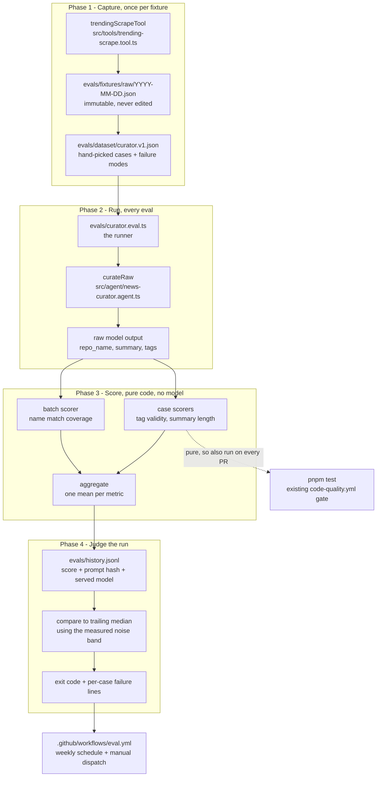

Two things to notice before you start. The scorers are pure functions with no model in
them, which is why they can run in your ordinary test gate on every PR. And the model
call happens exactly once per run, with all eight repos in one prompt — the same shape
production uses.

---

# Step 1 — Pick the target and name the failure it must catch

## DIAGRAM

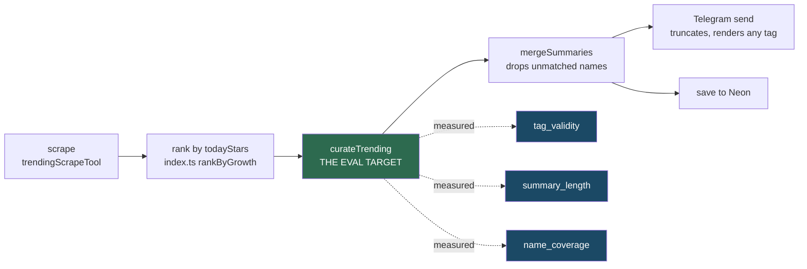

## HOW

Nothing to write yet. Write down three decisions, in a comment at the top of the file
you will create in Step 2, so you can check later that you kept them.

**Decision 1 — the target is `curateTrending`, not `runCuratorGraph`.**
`runCuratorGraph` (`src/agent/curator.graph.ts:22`) retries up to `MAX_ATTEMPTS = 2`
and feeds the parse error back into the next prompt. If you evaluate through the graph,
a model that fails half the time and gets rescued by the retry scores the same as a
model that is right first time. You would be measuring your error handling.

**Decision 2 — three metrics, each a separate number:**

| Metric | Question | Subject |
|---|---|---|
| `tag_validity` | Are all tags in the allowed 13, and are there 3–5 of them? | one repo |
| `summary_length` | Is the summary ≤ 140 characters *before* send-time truncation? | one repo |
| `name_coverage` | What fraction of input repos came back with an exactly-matching name? | the whole batch |

Do not average them into one "quality" number. Each has a different fix. A single
blended score tells you something changed and not what.

**Decision 3 — the batch size is `TRENDING_TOP_N` (8), because that is what production
sends** (`src/constants/index.ts:7`, applied at `src/agent/index.ts:166`).

## WHY

The obvious alternative to picking a narrow target is to "evaluate the trending job."
That fails for a specific reason: the job has five stages, and a bad number would not
tell you which one moved. Scraping is deterministic parsing and belongs in unit tests.
Ranking is a sort. Telegram formatting is string building. Only the curation step is
non-deterministic, so only it needs an eval. **Trade-off:** a narrow eval cannot catch
an integration failure between stages — it will not notice if you break the scrape.
That is what your 48 tests are for.

On Decision 3, matching production's batch size costs you the ability to test the
prompt at other sizes. It buys you a number that reflects reality. Long inputs degrade
instruction-following, so evaluating 14 repos when you ship 8 would report a worse
score than you actually get. Scoring a shape you never run is the single most common
way a first eval ends up lying.

## TEST

**No test in this step.** It produces decisions, not code. The test is retrospective:
when the eval first goes red, check that the failing metric points at exactly one
fixable thing. If it does not, the decomposition was wrong and you should split the
metric.

---

# Step 2 — Create the `evals/` workspace and make it typecheck

## DIAGRAM

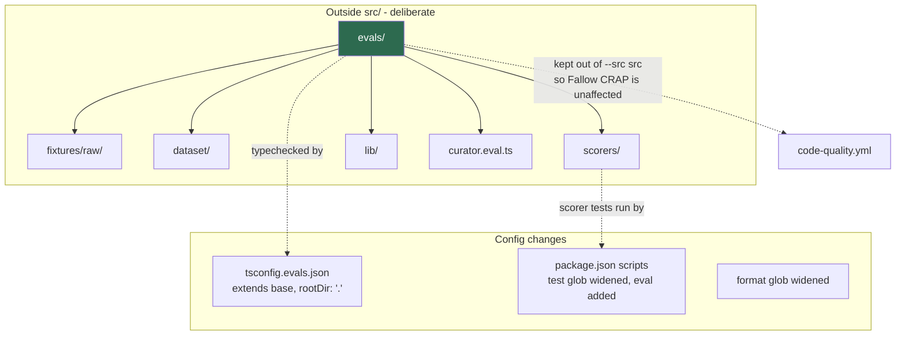

## HOW

Create the directories:

```
evals/fixtures/raw/    evals/dataset/    evals/scorers/    evals/lib/
```

Top-level, **not** `src/evals/`. Then three config changes.

**a) Typechecking.** Adding `"evals"` to `include` in `tsconfig.json` does not work.
I tried it; you get:

```
error TS6059: File '.../evals/probe.ts' is not under 'rootDir' '.../src'
```

`rootDir` is `./src` (`tsconfig.json:8`) and TypeScript validates it even under
`noEmit`. Create `tsconfig.evals.json` at the repo root instead: `extends` the base
config, override `compilerOptions.rootDir` to `"."`, and set
`include: ["evals/**/*", "src/**/*"]` (it needs `src` because your eval imports from it).
Add a `tsc:evals` script that runs `tsc --noEmit -p tsconfig.evals.json`. I confirmed
this passes clean.

> ⚠️ **Toy shortcut** — skip typechecking; `tsx` runs the file regardless.
> ✅ **Production version** — typecheck it. An eval with a type error is an eval that
> silently stops running, and you will not notice for weeks because nobody reads a
> passing scheduled job. Cost: one extra config file and one extra CI step.

**b) Scripts.** In `package.json`:

- widen `test` to two patterns: `--test "src/**/*.test.ts" "evals/**/*.test.ts"`.
  Pass them as two arguments rather than a `{src,evals}` brace pattern — I have not
  verified Node's test-runner glob supports brace expansion, and two arguments
  definitely work.
- widen `format` and `format:check` the same way, so Prettier covers `evals/`.
- add `eval`: `node --import tsx evals/curator.eval.ts`.

Leave `test:coverage` alone. It uses `--src src --all`, which pins the coverage
denominator to `src`, so eval files cannot drift into Fallow's CRAP scoring.

**c) Nothing else.** Do not install an eval framework. You will not understand your own
scores until you have written a scorer by hand, and everything here is under 200 lines.

## WHY

Keeping `evals/` out of `src/` is not aesthetic. Your `code-quality.yml` runs Fallow
with `FALLOW_COVERAGE: coverage/coverage-final.json` produced by
`c8 --src src --all`. The `--all` flag puts *every* file under `src` into the
denominator whether a test touches it or not. Fallow then computes
CRAP = complexity² × (1 − coverage)³ + complexity and your gate is `--gate new-only`,
which fails PRs on newly introduced complexity. Uncovered eval files inside `src` would
inflate the denominator and start failing PRs for reasons unrelated to the PR.

**Trade-off:** you now have two `tsconfig` files and a slightly longer scripts block.
The alternative — moving `rootDir` to `"."` in the base config — is one line instead of
a file, and it works. I lean toward the separate file because the base config is what
builds your shipped code and I would rather not widen its root for a test concern; but
this is genuinely close and the one-liner is defensible.

## TEST

Run `pnpm tsc && pnpm tsc:evals && pnpm test`. Pass: both typechecks silent, 48 tests
green (no eval tests exist yet, so the count should not change). Fail: TS6059 means the
`rootDir` override did not take; a dropped test count means your widened glob is
malformed and is now matching *fewer* files than before — check you passed two
arguments rather than concatenating them.

---

# Step 3 — Capture fixtures from real runs

## DIAGRAM

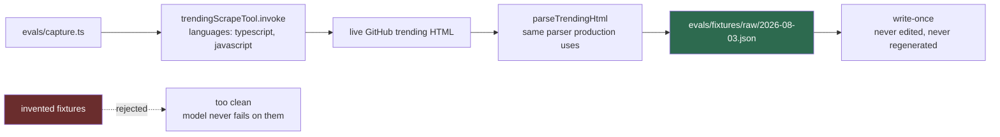

## HOW

Create `evals/capture.ts`. It is a script, not a module: it takes no arguments, calls
`trendingScrapeTool.invoke({ languages: ['typescript', 'javascript'] })` from
`src/tools/trending-scrape.tool.ts`, and writes the parsed array to
`evals/fixtures/raw/<today>.json`.

Three details that make it a fixture rather than a dump:

1. **Wrap the array in an envelope** carrying provenance — the capture date, the
   `languages` argument, the tool name, and the repo commit SHA you captured at. Shape:
   `{ capturedAt, source, languages, commit, repos: TrendingRepo[] }`.
2. **Refuse to overwrite.** Check existence first and exit non-zero if the file is
   there. A fixture that can be silently regenerated is not frozen.
3. **Pretty-print with a stable key order** so the file diffs readably in git.

Add a `capture` script to `package.json`. Scraping needs no API key — I ran it while
writing this and got 14 TypeScript repos in about two seconds.

Real output from that run, so you know what you are dealing with:

```json
{ "name": "usekaneo/kaneo",
  "description": "🎯 All you need. Nothing you don't. Open source project management that works for you, not against you.",
  "language": "TypeScript", "stars": 6672, "todayStars": 663 }
```

That description says nothing about what the project does. A bland summary for it is
the model correctly reflecting a bland input, not a bug. **Read your fixture before you
freeze it** — you are about to define "typical input", and knowing what is in there
stops you from "fixing" the prompt in response to noise.

## WHY

The obvious alternative is to hand-write eight tidy repos. It is faster and it is
useless: invented descriptions are well-formed, one clause long, and free of the emoji,
marketing copy, empty strings, and 300-character run-ons that real GitHub trending is
full of. Your model fails on the messy ones. An eval built on clean inputs scores near
1.0 forever and tells you nothing.

The other alternative is to scrape live on every eval run. That is worse than invented
data, because the score then moves for two reasons at once and you cannot separate
them: did the model get worse, or did today's repos just have vaguer descriptions?
**Trade-off:** a frozen fixture eventually stops resembling today's inputs. You handle
that by capturing new fixtures periodically and adding them as *new dataset versions*
(Step 12) — never by editing the old one.

## TEST

Run `pnpm capture` twice. Pass: first run writes a file; second run exits non-zero
without touching it. Then open the JSON and confirm the envelope fields are populated
and `repos.length` is in the low tens.

There is no unit test here, and that is deliberate: the script's only real behaviours
are a network call and a file write, so a test would be all mocks and would assert only
that you wrote the code you wrote. The two-run check above is the real test.

---

# Step 4 — Turn captures into a golden dataset with failure modes

## DIAGRAM

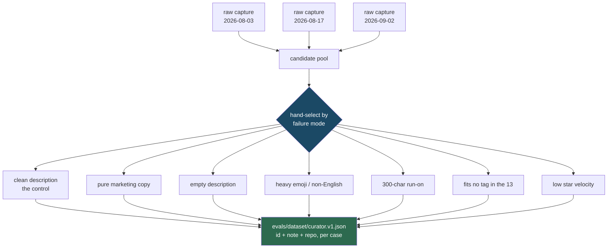

## HOW

Create `evals/dataset/curator.v1.json`. Structure:

```jsonc
{
  "version": 1,
  "capturedFrom": ["2026-08-03.json"],
  "cases": [
    { "id": "empty-description",
      "note": "parseTrendingHtml defaults description to '' — model must not invent a purpose",
      "repo": { "name": "...", "description": "", "language": "TypeScript", "stars": 900, "todayStars": 120, "url": "..." } }
  ]
}
```

Selection is the skill here, not volume. Go through your captures and pick repos that
represent *distinct ways the task is hard*. The seven in the diagram are the ones I would
start with; the empty-description case matters most because
`src/tools/trending-scrape.tool.ts:21` defaults a missing description to `''`, so it
genuinely occurs, and it is the case most likely to make the model invent functionality.

Target around 24 cases — three production-shaped batches of 8. Fewer than that and one
bad repo swings the score by a visible amount; more than that costs quota for
diminishing coverage. My opinion, not a rule: 15 well-chosen cases beat 40 scraped
indiscriminately.

Write the `id` and `note` for every case. They are not decoration. When
`empty-description` fails in four months, the note tells you what you were worried
about; without it you will stare at the row and guess.

Add a loader in `evals/lib/dataset.ts` — signature roughly
`loadDataset(path: string): { version: number; cases: EvalCase[] }` — which reads the
file, validates it with a small Zod schema, and throws on a duplicate `id`. You already
depend on Zod, and a dataset that silently loads with two cases sharing an id will
double-count one of them.

> ⚠️ **Toy shortcut** — take the first 8 rows of one capture.
> ✅ **Production version** — hand-pick across several captures for failure-mode
> coverage. Cost: an hour of reading descriptions, once. This is the single highest-value
> hour in the whole build, because an eval only measures the failures you put in front
> of it.

## WHY

The alternative — a large randomly-sampled dataset — optimises the wrong variable.
Random sampling from GitHub trending gives you mostly well-described popular repos,
which is the easy case, repeated. You want the score to move when the model gets worse
at the *hard* cases, and it can only do that if hard cases are a meaningful fraction of
the set. **Trade-off:** a deliberately hard dataset will score lower than production
reality. That is fine and you must remember it — the absolute number is not "how good
the digest is", it is a sensitive indicator that moves when quality moves. Do not quote
it as a quality percentage to anyone, including yourself.

On versioning: `curator.v1.json` is append-only. If you change an existing case you have
made every prior score incomparable. Adding cases also breaks comparability, so bump to
`v2` and start a new baseline series rather than editing in place.

## TEST

Write `evals/lib/dataset.test.ts`. Assert: the shipped `curator.v1.json` loads without
throwing; every case has a non-empty `id` and `note`; ids are unique; `cases.length` is
a multiple of 8 so it batches evenly. Then feed the loader an inline object with a
duplicated id and assert it throws with the id in the message.

Run with `pnpm test`. Pass: green, and the test count rises by the number of assertions
you added. Fail: a throw on the real file means your dataset is malformed — fix the JSON,
not the test.

---

# Step 5 — Make the model's raw output observable

## DIAGRAM

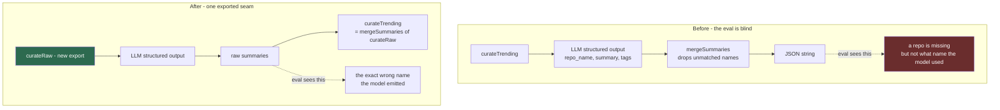

## HOW

This is a small change to production code, in `src/agent/news-curator.agent.ts`.

Extract the model call from `curateTrending` (currently lines 48–62) into a new exported
async function. Signature:

```ts
export async function curateRaw(
  repos: TrendingRepo[],
  feedback?: string
): Promise<z.infer<typeof SummarySchema>['repos']>
```

It contains everything `curateTrending` does today *except* the final
`mergeSummaries` + `JSON.stringify`: build the `listing`, build `content`, call
`createLlm(0.5).withStructuredOutput(SummarySchema).invoke(...)`, return `result.repos`.

`curateTrending` then becomes a two-line wrapper over it, preserving its exact current
signature and return value so nothing downstream changes.

Your eval imports `curateRaw`. Production keeps calling `curateTrending`.

## WHY

Without this, the eval cannot see the failure it is supposed to measure.
`mergeSummaries` (`src/agent/news-curator.agent.ts:27`) drops any repo whose `repo_name`
did not match, so by the time `curateTrending` returns, a mangled name is indistinguishable
from a repo the model skipped entirely. Your `name_coverage` metric could report *that*
something was lost but never *what the model actually emitted* — which is the one piece
of information that tells you whether to fix the prompt or give up and fix the code.

The obvious alternative is to copy the seven lines of the model call into the eval.
Never do this. A copied call drifts the first time you touch the prompt assembly, and
then your eval is measuring a function you do not ship — which is worse than no eval,
because it reports green while production is broken.

**Trade-off, stated honestly:** you are changing production code to serve a test. Some
people consider that a smell. I do not, and this is an opinion: making a system
observable at the boundary you need to measure is normal engineering, and here the change
is pure extraction with no behaviour difference. But it is a real cost — one more export
to keep stable.

## TEST

The existing `src/agent/news-curator.test.ts` covers `mergeSummaries` and must stay green
unchanged — that is your evidence the extraction was behaviour-preserving. Run `pnpm test`
before and after and compare counts and names.

Add one test asserting `curateTrending` still returns a JSON string parsing to
`{ repos: [...] }`, using a stubbed `curateRaw` if you can inject it, or skip this if
stubbing means restructuring — the existing `mergeSummaries` tests plus the typechecker
already cover most of the risk. **My opinion:** do not contort the module for
testability here; the extraction is small enough to review by eye.

---

# Step 6 — Write the scorers as pure functions

## DIAGRAM

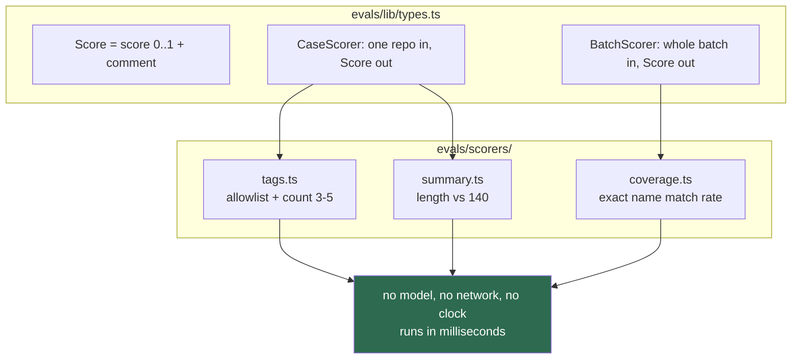

## HOW

**First, `evals/lib/types.ts`.** Two scorer shapes, because your metrics genuinely have
two subjects:

```ts
export type Score = { score: number; comment?: string }
export type CaseScorer = (expected: EvalCase, actual: RawSummary) => Score
export type BatchScorer = (expected: EvalCase[], actual: RawSummary[]) => Score
```

A `CaseScorer` answers a question about one repo. A `BatchScorer` answers one that only
exists across the batch — "how many came back?" cannot be asked of a single repo.

**Then `evals/scorers/tags.ts`.** Declare the allowlist as a `Set<string>` of the 13
values from `src/agent/prompt.ts:46`. A `Set` because you do membership checks in a
loop and `.has()` says what you mean.

The logic, in prose: partition the tags into valid and invalid against the allowlist;
if any are invalid, return `0` with a comment naming them; otherwise if the count is
outside 3–5, return `0` with a comment giving the actual count; otherwise return `1`.

The only fragment worth showing is the comment, because that is the part people leave
out and later regret:

```ts
if (invalid.length) return { score: 0, comment: `invalid tags: ${invalid.join(', ')}` }
```

Six weeks from now a bare `0.75` in a log is useless. `invalid tags: react, web` tells
you the model is not being stupid — it is picking sensible tags your prompt failed to
constrain — which points at a prompt fix rather than a model swap.

**`evals/scorers/summary.ts`** is the same shape: `1` if `summary.length <= 140`, else
`0` with the actual length in the comment. Measure the raw summary, *before* the
truncation at `src/tools/news-telegram.tool.ts:34`. The whole point is to see what the
truncation is hiding.

**`evals/scorers/coverage.ts`** is the batch scorer: build a `Set` of expected names,
count how many appear exactly in the actual output, return the fraction. The comment
should list the names the model emitted that matched nothing — that is the diagnostic
Step 5 exists to make possible.

Note the deliberate asymmetry: `tag_validity` and `summary_length` are binary per repo;
`name_coverage` is proportional. One invalid tag already breaks searchability as
completely as five do, so binary is right there. Losing 1 repo of 8 is genuinely
one-eighth as bad as losing 8, so proportional is right there. **This is a judgement
call and you may disagree** — but if you change one, note it in the history file,
because a proportional score cannot be compared against a binary baseline.

## WHY

The alternative is scorers that take the whole run and return one blended number. It is
less code and it is much worse to live with: you lose the ability to say *which*
constraint slipped, and you cannot run one metric more often than another.

Purity is the load-bearing property. No model, no network, no `Date.now()`. That is what
lets these run in your ordinary PR gate for free (Step 11) and lets you debug scoring
logic without spending API quota. **Trade-off:** purity means the scorers cannot
adaptively decide anything — e.g. they cannot ask a model "is `web3` close enough to
`framework`?". That is the correct restriction. If a property needs judgement, it is
not a deterministic scorer and it belongs in a different, calibrated layer you have not
built yet.

## TEST

That is Step 7 — it is substantial enough to be its own step.

---

# Step 7 — Test the scorers, including deliberately red

## DIAGRAM

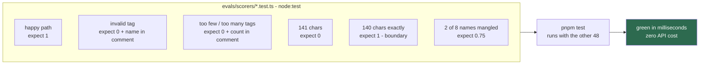

## HOW

One `*.test.ts` beside each scorer, using `node:test` and `node:assert/strict` — the same
style as `src/agent/news-curator.test.ts`, so there is nothing new to learn.

For each scorer write four kinds of case:

1. **Happy path** → asserts `score === 1`.
2. **The failure it exists to catch** → asserts `score === 0` *and* that the comment names
   the offender. That second assertion is the important one:

   ```ts
   assert.match(comment ?? '', /web3/)
   ```

   It is what keeps the comment honest when you refactor. A scorer that returns the right
   number with a useless comment is a scorer you will not act on.
3. **Boundaries.** Exactly 140 characters must pass; 141 must fail. Exactly 3 and exactly
   5 tags must pass; 2 and 6 must fail. Off-by-one errors in a scorer are silent and
   poisonous — they shift your baseline by a few percent and you attribute it to the model.
4. **Partial credit**, for `coverage` only: 8 expected, 6 matched → assert `0.75`.

## WHY

Testing your test code sounds circular. It is not, and the asymmetry is the argument: a
broken scorer that returns `1` too often produces a permanently green eval, which is
strictly worse than having no eval, because you will believe it. A broken scorer that
returns `0` too often produces noise you will eventually turn off. Neither failure is
detectable from the eval's own output.

The other reason is economic. These tests run in milliseconds with no API key. Every
scoring bug you find here is a bug you did not spend live model calls discovering —
and on OpenRouter's free tier those calls are a scarce daily resource (Step 11).

**Trade-off:** roughly 60 lines of test code for logic that is 30 lines. That ratio looks
wrong and is correct here, because the scorers are the measuring instrument. You calibrate
instruments.

## TEST

This step *is* the test. Run `pnpm test`; expect 48 plus your new cases, all green, total
runtime still a few seconds.

Then do the thing almost everyone skips: **break a scorer on purpose.** Invert the
allowlist check, confirm the suite goes red and that the failure message points at the
right test, then revert. A test you have never seen fail is not yet evidence of anything.

---

# Step 8 — Write the runner

## DIAGRAM

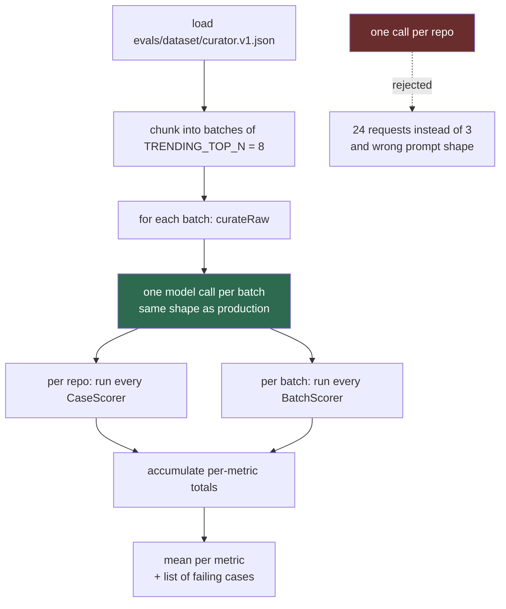

## HOW

Create `evals/curator.eval.ts`. It does five things in order: load the dataset, chunk it,
call the model per chunk, score, report.

**Chunking.** Group the cases into arrays of `TRENDING_TOP_N` (import the constant from
`src/constants/index.ts`; do not hardcode 8). 24 cases → 3 batches → 3 model calls.

**Calling.** Per batch, map each case's `repo` to a `TrendingRepo` and pass the array to
`curateRaw`. Pass no `feedback` — that parameter exists for the retry path and using it
would evaluate a different prompt from the one production sends first.

**Scoring.** For each returned summary, look up its case by exact name and run the
`CaseScorer`s. For each batch, run the `BatchScorer`s. Repos the model dropped get no
`CaseScorer` result at all — do not score them as `0` on tags. They are already counted
by `name_coverage`, and scoring them twice would make one failure move two metrics,
which destroys the "each metric points at one fix" property from Step 1.

**Reporting.** Print one line per metric, then the individual failures:

```
tag_validity     0.79  (19/24)
summary_length   0.92  (22/24)
name_coverage    0.96  (23/24 names matched)

  ✗ tag_validity  empty-description   invalid tags: web3, react
  ✗ name_coverage batch-2             model emitted "vercel/nextjs" for "vercel/next.js"
```

The means tell you *whether* to care; the per-case lines tell you *what to do*. An eval
that prints only a number sends you digging through LangSmith traces to find out what
happened.

Add error handling around the model call: on throw, record the batch as failed with the
error message and continue to the next batch. A rate-limit on batch 2 should not discard
batches 1 and 3.

> ⚠️ **Toy shortcut** — one model call per repo, because it is simpler to write.
> ✅ **Production version** — batch at production's size. This is not primarily about
> quota (though 3 requests versus 24 matters on a 50/day free tier). It is that
> `curateTrending` sends all 8 repos in one prompt, and a prompt with 8 repos in it is a
> measurably different instruction-following problem from a prompt with 1.

## WHY

The runner deliberately does not retry. `runCuratorGraph` retries in production and that
is correct there; here it would hide exactly what you are measuring, because a model
rescued by attempt 2 would score like a model that was right on attempt 1. **Trade-off:**
your eval score is therefore *pessimistic* relative to what your users see, since
production gets a second chance. That is the right direction to be wrong in, and it is
worth writing in a comment so you do not "fix" it later.

Naming the file `.eval.ts` rather than `.test.ts` is load-bearing: it keeps a slow,
network-dependent, occasionally rate-limited script out of the glob that gates your PRs.

## TEST

There is no unit test for the runner, and I want to be explicit about why: it is
integration glue whose parts are already tested — the dataset loader in Step 4, the
scorers in Step 7 — and the remaining behaviour is a live model call, which cannot be
asserted deterministically. Mocking the model here would test that your mock returns what
you told it to.

Test it by running it, twice:

```bash
LLM_API_KEY=... pnpm eval
```

**Pass:** three metrics printed, denominators equal to your case count, and every failing
line naming a real case id from your dataset.
**Fail, and what each means:** `LLM_API_KEY is not set` comes from `src/agent/llm.ts:27`
and is correct fail-fast behaviour. A denominator smaller than your case count means
chunking dropped cases. All three metrics at exactly `1.00` on the first run is
suspicious rather than good — verify by temporarily pointing the runner at a dataset case
you have edited to be unsatisfiable, and confirm the score moves.

---

# Step 9 — Record the run with full provenance

## DIAGRAM

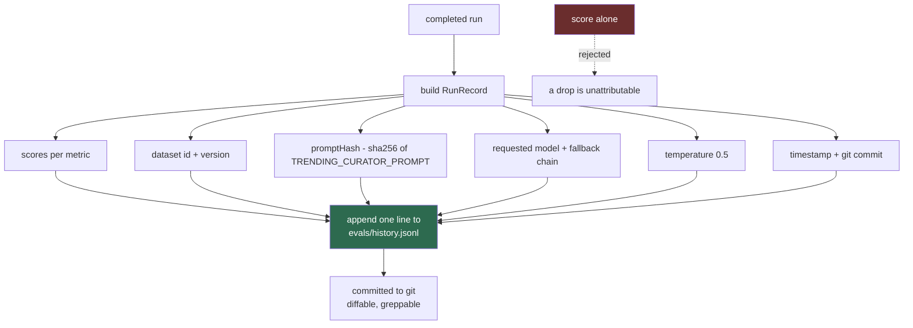

## HOW

Add `evals/lib/record.ts`. One type and one append function.

```ts
export type RunRecord = {
  ts: string; commit: string; dataset: string; datasetVersion: number
  promptHash: string; model: string; fallbacks: string[]; temperature: number
  scores: Record<string, { mean: number; n: number }>
  failures: Array<{ metric: string; caseId: string; comment: string }>
}
```

`appendRun(record)` serialises with `JSON.stringify` and appends one line plus `\n` to
`evals/history.jsonl`. Open in append mode; never read-modify-write, so two runs cannot
clobber each other.

**`promptHash`** goes in `evals/lib/fingerprint.ts`: import `TRENDING_CURATOR_PROMPT`
from `src/agent/prompt.ts`, hash it with `node:crypto`, keep the first 8 hex characters.

```ts
createHash('sha256').update(TRENDING_CURATOR_PROMPT).digest('hex').slice(0, 8)
```

Importing the real prompt rather than pasting a copy is the whole point: the hash changes
automatically when you edit the prompt, with nothing to remember.

**The model field is where this gets interesting, and where I am partly unsure.**
`src/agent/llm.ts:37` sends `modelKwargs: { models: [primary, ...fallbacks].slice(0, 3) }`,
so OpenRouter may serve `nemotron-3-super-120b` or `gemma-4-31b` when the primary is at
capacity — *without any signal in your code*. A score drop caused by silent model
substitution looks exactly like a score drop caused by your prompt edit.

Two options:

- **Record what you requested.** Log `process.env.LLM_MODEL || DEFAULT_LLM` plus the
  whole `LLM_FALLBACK_MODELS` chain. Zero code change. Leaves a known blind spot: you
  know which three *could* have served it, not which one did.
- **Record what actually served it.** LangChain's `.withStructuredOutput(schema, { includeRaw: true })`
  returns `{ raw, parsed }`, and the served model name should be on `raw.response_metadata`.
  **I have not run this against OpenRouter and cannot promise the field name** — log the
  whole `response_metadata` object once and pick the key. It also means changing
  `curateRaw`'s return type, so production code changes again.

My recommendation: ship option 1 now, and lean on LangSmith for the gap —
`morning-news.yml` already sets `LANGSMITH_TRACING: 'true'`, and traces record the served
model. Move to option 2 the first time a score drop is genuinely ambiguous. This is a
judgement call about effort, not a technical necessity.

## WHY

The alternative is printing scores to stdout and reading them in the CI log. That is a
toy, for one reason: without history you cannot compute the trailing median that Step 10
needs, so you are stuck with absolute thresholds — which either sit so low they never
fire or so high they fire on noise.

JSONL rather than a database or CSV: it appends without parsing, diffs sanely in git,
`grep`s, and needs no schema migration when you add a metric. **Trade-off:** it is not
queryable and it grows forever. At weekly runs that is 52 lines a year, so this will not
be a problem before the project outlives its usefulness.

Recording provenance is what makes the number *survive change*. Every field exists to
answer one question after a drop: `promptHash` — did I change the prompt? `model` — did
the provider swap under me? `datasetVersion` — am I comparing like with like? `commit` —
what else changed? Without them, a red eval is an unfalsifiable worry.

## TEST

Write `evals/lib/record.test.ts` — pure, no model.

Assert `fingerprint()` is stable across two calls, is 8 characters, and differs for a
different input string. Assert `appendRun` writes exactly one line ending in `\n`, that
the line round-trips through `JSON.parse` to a deep-equal object, and that appending twice
produces two lines with the first unmodified. Use a temp path, not the real
`history.jsonl`.

Run with `pnpm test`. Fail modes worth recognising: a fingerprint that changes between
calls means you hashed something with a timestamp in it; a second append that truncates
the file means you opened with `w` instead of `a`.

---

# Step 10 — Turn the score into a verdict

## DIAGRAM

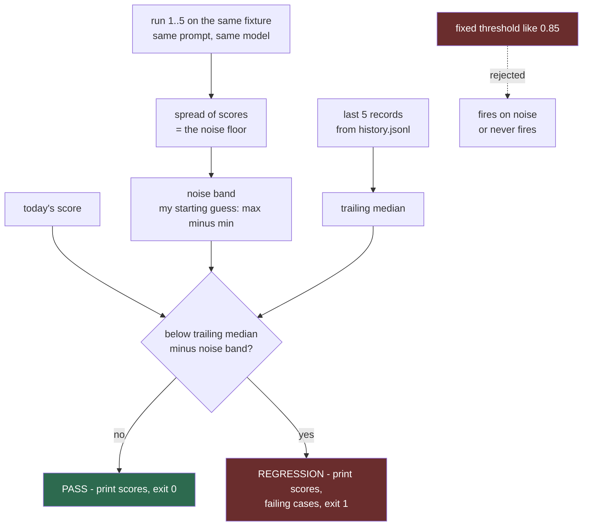

## HOW

**First, measure the noise floor. This is a manual step and it is not optional.**

`curateTrending` calls `createLlm(0.5)` (`src/agent/news-curator.agent.ts:55`) —
temperature 0.5, not 0. The model gives different answers to identical input. Run
`pnpm eval` five times against the same dataset, unchanged prompt, and write down the
five numbers per metric. If `tag_validity` comes back `0.79, 0.83, 0.79, 0.88, 0.75`,
your noise band is roughly ±0.07 and a change from 0.79 to 0.83 next month means nothing.

You cannot set a threshold before you know this. Redo it whenever you change the model or
the temperature.

**Then, `evals/lib/verdict.ts`.** Signature roughly:

```ts
verdict(current: RunRecord, history: RunRecord[], band: number):
  { ok: boolean; regressions: Array<{ metric: string; now: number; baseline: number }> }
```

Logic in prose: filter history to records with the *same* `datasetVersion` and
`promptHash` — comparing across a prompt change is meaningless. Take the last five, per
metric compute the median. A metric regresses if `current < median - band`. Return `ok`
only if nothing regressed. With fewer than three comparable history records, return
`ok: true` and say so in the output — you are still collecting a baseline.

Wire it into the runner: print `PASS` or `REGRESSION` with the metric, today's score, and
the baseline it fell below. **Gate the exit code behind an env flag** — `EVAL_GATE=1`
sets `process.exitCode = 1` on regression; without it the runner always exits 0.

> ⚠️ **Toy shortcut** — a fixed threshold, `fail if score < 0.85`.
> ✅ **Production version** — a delta against the trailing median, with a band you
> measured. A fixed threshold has no idea what your model's normal is; on a free-tier
> model at temperature 0.5 it will either sit below the noise and never fire, or sit
> inside it and cry wolf weekly. Cost: you cannot gate until you have several runs of
> history. That is a feature — it stops you gating on a number you do not understand yet.

Median rather than mean, because one rate-limited run producing a garbage score would drag
a mean down for weeks.

## WHY

The alternative to a verdict is a number you interpret yourself each week. That decays
predictably: you will read it carefully for a month and then stop, and the eval becomes a
scheduled job that burns quota and informs nobody. A verdict converts a metric into a
decision, which is the only form that survives you losing interest.

The `EVAL_GATE` flag exists because turning on a gate before you know your noise floor
produces a red build you learn to ignore — and a gate you ignore is worse than no gate,
because it trains you to dismiss red. **Trade-off:** an ungated eval can be ignored too.
The mitigation is Step 11's notification path, not an earlier gate.

Where I am unsure: whether "max minus min over five runs" is the right band. It is crude
and will overestimate on a small sample. A standard deviation over more runs would be
better statistics but costs quota you may not want to spend. I would start crude, and only
get more careful if the verdict turns out to be flapping.

## TEST

`evals/lib/verdict.test.ts`, pure, with hand-built `RunRecord` fixtures — no file I/O, no
model.

Assert: a score inside the band passes; a score below `median − band` regresses and names
the metric; history with a different `promptHash` is excluded (build a case where
including it would flip the verdict, and assert it does not); fewer than three comparable
records returns `ok: true`; one wild outlier in history does not move the median enough to
flip a genuine regression to a pass.

Pass looks like green under `pnpm test`. The most valuable failure to see deliberately:
delete the `promptHash` filter and confirm the exclusion test goes red. That filter is the
thing standing between you and comparing scores across two different prompts.

---

# Step 11 — Run it in CI

## DIAGRAM

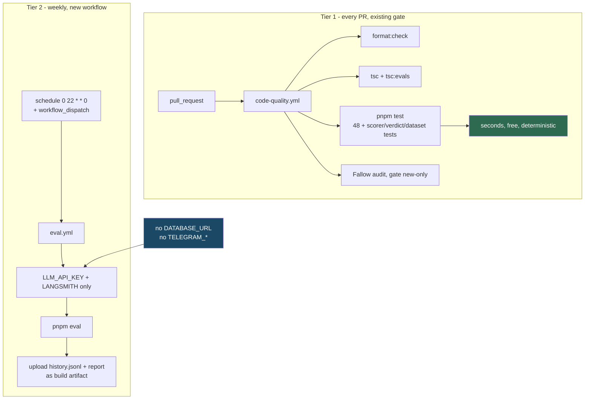

## HOW

**Tier 1 — nothing new to build.** Your Step 2 glob change already means the scorer,
dataset, verdict and record tests run inside the existing `test` job of
`code-quality.yml`. Add `pnpm tsc:evals` as a step in the `typecheck` job so eval code
cannot rot into a type error unnoticed.

**Tier 2 — a new `.github/workflows/eval.yml`.** Copy the skeleton from
`morning-news.yml`, which already has the right shape, and change five things:

- `on: schedule` weekly, e.g. `cron: '0 22 * * 0'`, plus `workflow_dispatch`.
- Keep the repo's `if: github.event_name == 'schedule' || github.actor == 'DamengRandom'`
  guard, matching your other workflows.
- `env:` gets `LLM_API_KEY` and the `LANGSMITH_*` trio. **Nothing else.**
- `run: pnpm eval`.
- Upload `evals/history.jsonl` and the printed report with `actions/upload-artifact`.

The omissions are the important part. **No `DATABASE_URL`, no `TELEGRAM_BOT_TOKEN`, no
`TELEGRAM_CHAT_ID`.** An eval must be side-effect free: it must not write to Neon and must
not message your phone. Withholding the secrets is a stronger guarantee than remembering
not to call those code paths.

**Quota.** OpenRouter's free tier is roughly 20 requests/minute and 50/day (my
recollection — check your current account limits rather than trusting this number). A
24-case dataset batched at 8 is 3 requests per run. Weekly, that is negligible. Per-repo
calls would be 24, and any judge layer added later would double whatever you land on.
Batching is not a quota trick; it is production shape, and cheap quota is the bonus.

> ⚠️ **Toy shortcut** — add `pnpm eval` to the PR gate so it "runs in CI".
> ✅ **Production version** — deterministic checks on every PR, live-model evals on a
> schedule. A live eval in the PR gate adds a minute to every push, burns quota on README
> typos, and blocks merges whenever OpenRouter happens to be rate-limiting. Cost: a
> regression is caught within a week rather than at the commit that caused it — and
> `promptHash` in the history tells you which commit that was.

**Do not commit `history.jsonl` from CI.** A workflow that pushes to master on a schedule
creates noise and needs write permissions for a file only you read. Upload it as an
artifact; append locally when you run by hand. Revisit if the weekly run becomes genuinely
load-bearing.

## WHY

The two-tier split exists because the two halves have different failure characteristics.
Scorers are pure and fast, so gating on them is free and their red always means "you broke
something". The live eval is slow and can go red because a provider had a bad minute — and
a gate that fails for reasons outside the PR is a gate people route around.

**Trade-off, and it is a real one:** weekly means up to seven days between a regression
landing and you seeing it. You could run daily for 7× the quota; my opinion is that weekly
is right for a digest that is a personal convenience, and I would move to daily only if
you ever have a week where the digest was visibly wrong and the eval had not yet run.

## TEST

Trigger `eval.yml` manually via `workflow_dispatch` before trusting the schedule. **Pass:**
the run completes, the log shows three metrics and a `PASS`/`still collecting baseline`
line, and the artifact contains a `history.jsonl` with one more line than you started with.
**Fail:** `LLM_API_KEY is not set` means the secret name does not match; a run that writes
to Neon means you copied the `env:` block wholesale from `morning-news.yml` — remove
`DATABASE_URL`.

For Tier 1, open a throwaway PR containing a deliberately broken scorer and confirm
`code-quality.yml` goes red on the `test` job. Then close it. This is the only way to know
the widened glob is actually running your eval tests in CI rather than silently matching
nothing.

---

# Step 12 — Keep it honest as prompts and models change

## DIAGRAM

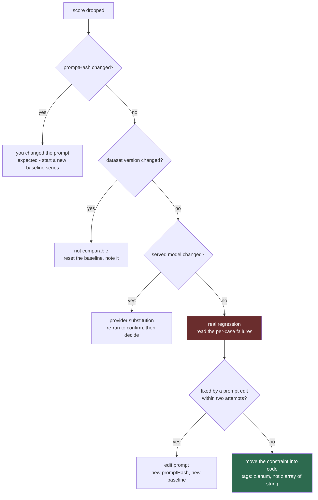

## HOW

No new code. This step is the operating procedure, and it is what makes the previous
eleven worth having.

**When you change the prompt on purpose.** `promptHash` changes, so Step 10's verdict
automatically stops comparing against the old series and reports "collecting baseline"
until three runs accumulate. That is correct behaviour, not a bug. Run `pnpm eval` three
times right after the change so you have a usable baseline again.

**When you add dataset cases.** Bump to `curator.v2.json`. The verdict filters on
`datasetVersion`, so v1 history is excluded automatically. Keep `v1` in the repo — the old
scores stay interpretable.

**When the score drops and nothing of yours changed.** Follow the diagram. The most likely
cause on your setup is provider substitution, because `src/agent/llm.ts:37` sends a
three-model chain and OpenRouter picks silently. Re-run once; if it recovers, it was
capacity. If it persists, check the LangSmith trace for the served model.

**When a metric stays red after two honest prompt attempts — stop prompting and change the
code.** This is the most useful thing your eval will ever tell you. For tags specifically
the fix is small: change `SummarySchema` at `src/agent/news-curator.agent.ts:13` from
`z.array(z.string())` to a `z.enum` over the 13 allowed values, so structured output
enforces the constraint at the API layer instead of asking politely in prose.

That is not the eval failing. That is the eval having done its job: it proved the
constraint needed enforcing, and it will now regression-guard the code that enforces it.
**My honest prediction, which is a guess:** for the tag list you will end up here. I have
not run your model, so I do not know how far off `0.79` my invented example is.

**One duplication to be aware of now.** Your allowlist will exist in two places — the
prompt string at `src/agent/prompt.ts:46` and the `Set` in `evals/scorers/tags.ts`. Edit
one, forget the other, and your eval passes while production is wrong. Three ways out:
leave it duplicated and accept the risk; export the list from `src/constants/index.ts`
and interpolate it into the prompt; or keep them separate and add a test asserting every
allowlist value appears in `TRENDING_CURATOR_PROMPT`. **I would take the third today** —
five lines, catches the drift, no change to how the prompt reads — and consider the second
later if you start versioning prompts. This is a preference, not a correctness argument.

**Recapture fixtures roughly quarterly** so the dataset does not drift too far from what
GitHub trending actually looks like. New capture, new dataset version, new baseline series.
Never edit an existing case.

## WHY

The alternative is to treat a red eval as a thing to silence. Every eval that ever got
deleted was deleted at this moment. The decision tree exists so that "the eval is red" has
a defined next action every time, including the actions "this is expected" and "the eval
was right and the answer is a code change".

**Trade-off:** following this properly means a prompt edit costs you three extra eval runs
to rebuild the baseline. That is real friction, and it is the price of a number you can
trust. The alternative — comparing across prompt versions — gives you a number that is
cheap and meaningless.

## TEST

Test the procedure once, deliberately, while you still remember how it works.

Make a trivial whitespace-only edit to `TRENDING_CURATOR_PROMPT`, run `pnpm eval`, and
confirm the output says it is collecting a new baseline rather than comparing against the
old series. Revert. **Pass:** the verdict noticed the prompt change without you telling it.
**Fail:** if it happily compared across the change, your `promptHash` is not being computed
from the live prompt import — check `evals/lib/fingerprint.ts` is importing from
`src/agent/prompt.ts` rather than hashing a pasted copy.

---

## What you have at the end

Three metrics on a frozen, failure-mode-rich dataset drawn from real scrapes; scored by
pure functions that are themselves tested; run at production's batch size against the real
curator; recorded with enough provenance to attribute a drop; judged against a measured
noise band; running weekly in CI without touching your database or your phone; and with a
defined action for every way it can go red.

That is a production eval. It is roughly 200 lines of code and an hour of reading GitHub
descriptions.

## What I would not build

- **An eval for `githubAgent`.** One tool, `runLimit: 1`, a prompt that says "return the
  result as-is", and schema-validated tool output. There is no generation to score.
- **An eval for `diaryAgent`'s prose.** It has exactly one reader, you, and you read it
  daily. Building a judge automates a review you already do for free. Do keep the
  scaffold tests around `toKpiRecord` — a report that fails to save is the failure that
  actually costs you something, and that is codeable.
- **An eval framework**, until you find yourself badly reimplementing one of its features.
- **Embedding or semantic-similarity scores.** You have no reference summaries, and
  inventing them means scoring the model against your own prose style.
- **Generic metrics** — "helpfulness", "coherence". They produce a number that never
  moves and never suggests an action.

## Where I am unsure

Stated plainly, so you can discount appropriately:

- I have not run your model against this dataset. Every score in this document is
  invented for illustration. Your real numbers may be much better or much worse, and the
  thresholds in Step 10 must come from your own five runs, not from me.
- The `raw.response_metadata` field name for the served model (Step 9) is unverified
  against OpenRouter.
- The free-tier rate limits quoted in Step 11 are from memory; check your account.
- Whether "max minus min over five runs" is a good noise band (Step 10) is a guess. It is
  crude on purpose; refine it if the verdict flaps.
- Whether a 24-case dataset is the right size is a judgement call, not a finding. I would
  rather you ship 16 well-chosen cases than stall on assembling 40.
