# 你的第一个生产级 eval

这是一份面向 `oh-my-workers` 的构建指南。读完之后，你会拥有一个 eval：它衡量 trending curator
是否遵守了你在 prompt 里写下的约束，为其打分，记住这个分数，并在它变差时告诉你。

本文可以独立阅读，不需要你先看过任何其他文档。

**凡是我在陈述观点而非事实的地方，我都会明说。** 关于你代码的事实都以 `file:line` 标注，并且是从
`master` 上读出来的。关于模型行为的判断大多是观点，因为我没有真正跑过你的模型。

---

## 什么叫「生产级」，以及为什么这里很重要

大多数 eval 教程做的是玩具：几条自己编的输入，跑一次，往终端里打印一个数字，然后再也不跑第二次。
那是对概念的演示。它不会在十一月份某天告诉你，你的 digest 已经悄悄变差了。

两者之间有七点区别。这份指南会在每一点上都守住生产级的标准。

| | 玩具 eval | 生产级 eval |
|---|---|---|
| **Fixtures** | 自己编的输入，比现实干净得多 | 从真实运行中捕获的输入，保持不可变并带日期戳 |
| **确定性** | 每次跑都用新数据，分数因为未知原因波动 | 输入冻结；只允许 prompt 和模型变化 |
| **Baseline** | 终端里的一个数字，关掉窗口就没了 | 只追加的历史文件，每次运行都带完整来源信息 |
| **失败模式** | 只有 happy path 样例 | 刻意纳入困难样例，选它们正是因为它们会出问题 |
| **CI** | 想起来就手动跑一次 | 定时 workflow，加上纯代码部分在每个 PR 上跑 |
| **抗变更** | 改一次 prompt 或换一次模型之后就悄悄失去意义 | 记录 prompt hash 与实际服务的模型，分数下跌可归因 |
| **产出** | 「看着还行」 | 一个分数、一次对 baseline 的判定，以及具体是哪些 case 失败了 |

全文中凡是只有玩具才能接受的捷径，都会这样标出来：

> ⚠️ **玩具捷径** —— 大多数人的做法。
> ✅ **生产级做法** —— 应该怎么做，以及代价是什么。

---

## 你到底在评估什么

你的 trending digest 每天早上通过 `.github/workflows/morning-news.yml` 无人值守地运行。模型的
职责写在 `src/agent/prompt.ts:38-48`。其中有四条指令只是用散文写着，没有任何东西强制执行：

| Prompt 指令 | 今天由什么强制执行 | 模型不听话时会发生什么 |
|---|---|---|
| tags 必须来自列出的 13 个值 | 无。`SummarySchema` 把 tags 定义为 `z.array(z.string())`（`src/agent/news-curator.agent.ts:13`） | `#web3` 会和 `#framework` 一起被渲染成 hashtag（`src/tools/news-telegram.tool.ts:39`），悄悄破坏掉 prompt 存在的意义 —— 日复一日的可搜索性 |
| 每个 repo 有 3–5 个 tags | 无 —— 既没有下限也没有上限 | 一个 tag 或十一个 tag，都会照发不误 |
| Summary 少于 140 字符 | 发送时截断（`src/tools/news-telegram.tool.ts:34`） | 从句子中间被切断并接上 `...`。是被投递出去了，不是失败 |
| `repo_name` 必须原样返回 | 部分执行。`mergeSummaries` 会丢掉任何名字没对上的 repo（`src/agent/news-curator.agent.ts:27`） | 8 个里对上 7 个 → 发出一份 7 条的 digest，任何地方都没有警告。0 个对上 → `curated` 是 `[]`，而 `src/agent/index.ts:350-352` 把它当作一次*跳过*，只记一条 info 日志，没有告警 |

最后一行我实际跑真实的 graph 验证过，传入一个什么都匹配不上的 curator：

```
curated = [] | error = null   →  生产环境打印 "⏭️ No repos curated" 然后停止
```

也就是说今天这个失败在两个方向上都是不可见的：部分丢失无人上报，而全部丢失看起来像一次安静的空操作。
**这正是你的第一个 eval 要抓住的失败。** 它适合做第一个 eval，恰恰是因为约束毫不含糊、打分是纯代码，
而且仓库里没有任何其他东西覆盖它。

你现有的 48 个测试（`pnpm test`）不是 eval，本文也不是要取代它们。它们检查的是模型*周围*的代码 ——
`src/agent/curator-graph.test.ts` 传入一个假的 `curate` 函数，从不调用模型。它们回答的是「我的重试
逻辑好使吗？」而 eval 回答的是「模型遵守了吗，遵守的频率是多少？」两者都要留着；它们因不同的原因失败，
也在不同的地方修复。

本指南刻意不涉及：判断一条 summary 是不是*好*。那需要第二个模型给第一个模型打分，而那个模型在用你亲手
标注的判断校准过之前，它给出的数字没有意义。先把确定性这一层建起来。我的观点，直说：对这个仓库来说，
大部分价值都在确定性这一层，而一个未经校准的 judge 比没有 judge 更糟，因为它制造出虚假的信心。

---

## 整体流程

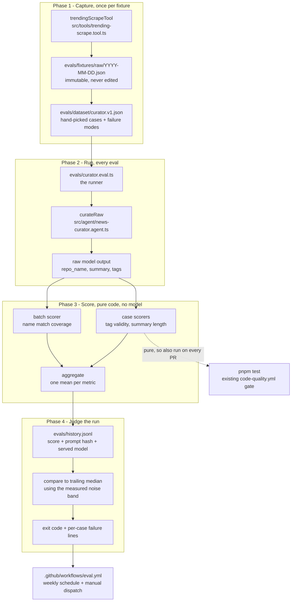

动手之前先注意两点。scorer 是不含模型的纯函数，这正是它们能在每个 PR 的常规测试关卡里免费运行的原因。
另外，每次运行只调用模型一次，八个 repo 全都放在同一个 prompt 里 —— 和生产环境用的形状完全一致。

---

# 第 1 步 —— 选定目标，并明确它必须抓住的失败

## DIAGRAM

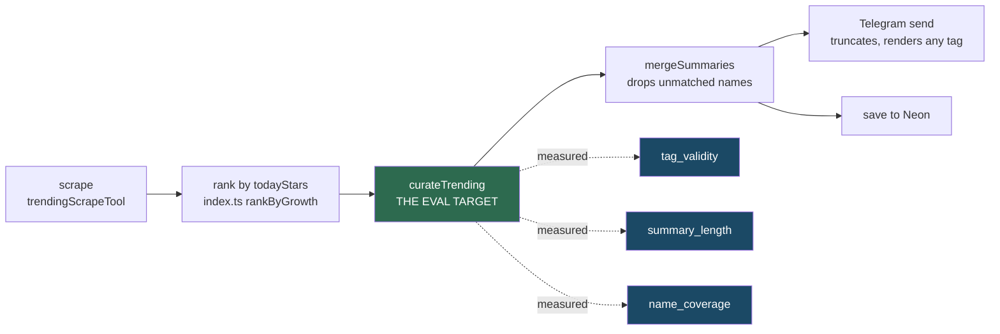

## HOW

这一步还不用写代码。把三个决定写下来，放在第 2 步会创建的文件顶部的注释里，这样以后你可以检查自己有没有
守住它们。

**决定 1 —— 目标是 `curateTrending`，不是 `runCuratorGraph`。**
`runCuratorGraph`（`src/agent/curator.graph.ts:22`）最多重试 `MAX_ATTEMPTS = 2` 次，并把解析错误
喂回下一次 prompt。如果你透过 graph 去评估，一个有一半概率失败但被重试救回来的模型，得分会和一次就做对的
模型一模一样。你测的其实是你的错误处理。

**决定 2 —— 三个指标，各自是独立的数字：**

| 指标 | 问题 | 主体 |
|---|---|---|
| `tag_validity` | 所有 tag 都在允许的 13 个之内吗？数量是 3–5 个吗？ | 单个 repo |
| `summary_length` | summary 在发送时截断*之前*是否 ≤ 140 字符？ | 单个 repo |
| `name_coverage` | 输入的 repo 中，有多大比例带着完全匹配的名字回来了？ | 整个批次 |

不要把它们平均成一个「质量」数字。每个指标对应不同的修法。一个混合分数只会告诉你有东西变了，却不告诉你是什么。

**决定 3 —— 批次大小是 `TRENDING_TOP_N`（8），因为生产环境就是这么发的**
（`src/constants/index.ts:7`，在 `src/agent/index.ts:166` 处应用）。

## WHY

选窄目标的显然替代方案是「评估整个 trending job」。这样做会失败，原因很具体：这个 job 有五个阶段，一个变差的
数字不会告诉你是哪个阶段动了。抓取是确定性的解析，属于单元测试。排序就是一次 sort。Telegram 格式化是字符串
拼接。只有 curation 这一步是非确定性的，所以只有它需要 eval。**权衡：** 一个窄 eval 抓不到阶段之间的集成
故障 —— 你把 scrape 弄坏了它不会察觉。那是你那 48 个测试的职责。

关于决定 3：与生产批次大小对齐，代价是你没法在其他规模下测试 prompt。换来的是一个反映现实的数字。长输入会
削弱指令遵循能力，所以你发 8 条却评估 14 条，报出来的分数会比实际更差。**评估一个你从不真正运行的形状，是
第一个 eval 最常见的说谎方式。**

## TEST

**这一步不需要测试。** 它产出的是决定，不是代码。它的检验是回溯性的：当 eval 第一次变红时，检查失败的那个
指标是否精确指向了一件可修的事。如果不是，说明拆分错了，你应该把这个指标再拆开。

---

# 第 2 步 —— 创建 `evals/` 工作区并让它通过类型检查

## DIAGRAM

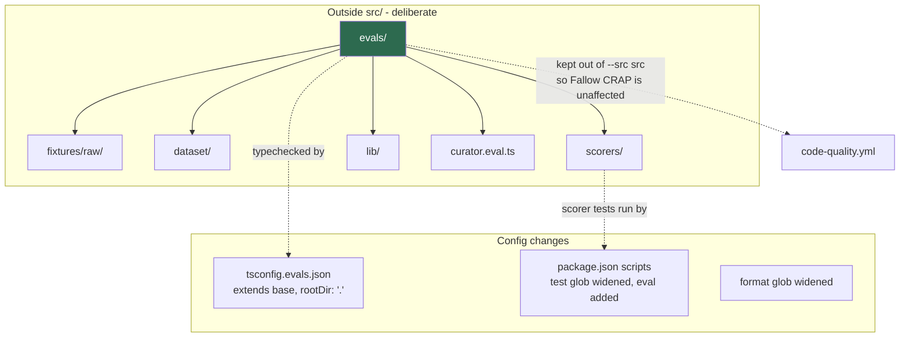

## HOW

创建目录：

```
evals/fixtures/raw/    evals/dataset/    evals/scorers/    evals/lib/
```

放在顶层，**不要**放 `src/evals/`。然后是三处配置改动。

**a) 类型检查。** 在 `tsconfig.json` 的 `include` 里加 `"evals"` 是行不通的。我试过，会得到：

```
error TS6059: File '.../evals/probe.ts' is not under 'rootDir' '.../src'
```

`rootDir` 是 `./src`（`tsconfig.json:8`），而 TypeScript 即使在 `noEmit` 下也会校验它。改为在仓库
根目录创建 `tsconfig.evals.json`：用 `extends` 继承基础配置，把 `compilerOptions.rootDir` 覆盖为
`"."`，并设置 `include: ["evals/**/*", "src/**/*"]`（需要 `src` 是因为你的 eval 会从中 import）。
再加一个 `tsc:evals` script 运行 `tsc --noEmit -p tsconfig.evals.json`。我确认过这样能干净通过。

> ⚠️ **玩具捷径** —— 跳过类型检查；反正 `tsx` 照样能跑这个文件。
> ✅ **生产级做法** —— 检查它。一个有类型错误的 eval 就是一个悄悄停止运行的 eval，而你几周都不会发现，
> 因为没人会去读一个通过了的定时任务。代价：多一个配置文件和一个 CI 步骤。

**b) Scripts。** 在 `package.json` 里：

- 把 `test` 扩成两个 pattern：`--test "src/**/*.test.ts" "evals/**/*.test.ts"`。
  用两个参数而不是 `{src,evals}` 花括号写法 —— 我没有验证过 Node 测试运行器的 glob 是否支持花括号展开，
  而两个参数肯定可行。
- 用同样的方式扩展 `format` 和 `format:check`，让 Prettier 覆盖 `evals/`。
- 加上 `eval`：`node --import tsx evals/curator.eval.ts`。

`test:coverage` 保持不动。它用的是 `--src src --all`，把覆盖率分母锁定在 `src`，所以 eval 文件不可能
混进 Fallow 的 CRAP 评分里。

**c) 别的都不要做。** 不要安装 eval 框架。在你亲手写过一个 scorer 之前，你不会真正理解自己的分数，而这里
所有东西加起来不到 200 行。

## WHY

把 `evals/` 放在 `src/` 之外不是审美问题。你的 `code-quality.yml` 运行 Fallow 时带着
`FALLOW_COVERAGE: coverage/coverage-final.json`，这个文件由 `c8 --src src --all` 生成。`--all`
标志会把 `src` 下的*每一个*文件都放进分母，不管有没有测试碰过它。然后 Fallow 计算
CRAP = complexity² × (1 − coverage)³ + complexity，而你的关卡是 `--gate new-only`，会因为 PR 新引入
的复杂度而让 PR 失败。放在 `src` 里的、没有覆盖的 eval 文件会撑大分母，开始因为与 PR 无关的原因让 PR 失败。

**权衡：** 你现在有两个 `tsconfig` 文件和一段更长的 scripts。另一种做法 —— 把基础配置里的 `rootDir` 改成
`"."` —— 是一行而不是一个文件，而且也能用。我倾向于单独一个文件，因为基础配置是用来构建你要发布的代码的，
我不太愿意为了测试的需要放宽它的根目录；但这真的很接近，那个一行方案也完全站得住脚。

## TEST

运行 `pnpm tsc && pnpm tsc:evals && pnpm test`。通过：两次类型检查都静默无输出，48 个测试全绿（此时还没有
eval 测试，所以数量不应该变）。失败：出现 TS6059 说明 `rootDir` 覆盖没生效；测试数量下降说明你扩展的 glob
写错了，现在匹配到的文件比之前*更少* —— 检查你传的是两个参数而不是把它们拼成了一个。

---

# 第 3 步 —— 从真实运行中捕获 fixtures

## DIAGRAM

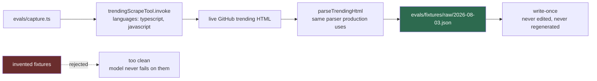

## HOW

创建 `evals/capture.ts`。它是脚本而不是模块：不接受参数，从 `src/tools/trending-scrape.tool.ts` 调用
`trendingScrapeTool.invoke({ languages: ['typescript', 'javascript'] })`，然后把解析出的数组写到
`evals/fixtures/raw/<today>.json`。

有三个细节让它成为 fixture 而不是一次随手转储：

1. **把数组包在一个信封里**，携带来源信息 —— 捕获日期、`languages` 参数、工具名，以及你捕获时所在的仓库
   commit SHA。形状：`{ capturedAt, source, languages, commit, repos: TrendingRepo[] }`。
2. **拒绝覆盖。** 先检查文件是否存在，存在就以非零码退出。一个可以被悄悄重新生成的 fixture 不叫冻结。
3. **用稳定的 key 顺序 pretty-print**，让文件在 git 里的 diff 可读。

在 `package.json` 里加一个 `capture` script。抓取不需要 API key —— 我写这份文档时跑过一次，大约两秒拿到
14 个 TypeScript repo。

那次运行的真实输出，让你知道要面对的是什么：

```json
{ "name": "usekaneo/kaneo",
  "description": "🎯 All you need. Nothing you don't. Open source project management that works for you, not against you.",
  "language": "TypeScript", "stars": 6672, "todayStars": 663 }
```

这段描述完全没说这个项目是干什么的。模型为它写出一条平淡的 summary，是模型正确地反映了平淡的输入，不是 bug。
**在冻结之前先读一遍你的 fixture** —— 你正要定义什么叫「典型输入」，而知道里面有什么，能阻止你为了噪声去
「修」prompt。

## WHY

显然的替代方案是手写八个整洁的 repo。这更快，也没用：编出来的描述结构良好、只有一个从句，并且不含真实的
GitHub trending 里遍地都是的 emoji、营销话术、空字符串和 300 字符的长句。你的模型正是在这些脏数据上失败。
建立在干净输入上的 eval 会永远接近 1.0，什么也告诉不了你。

另一个替代方案是每次跑 eval 都实时抓取。这比编数据还糟，因为分数会同时因为两个原因而移动，而你无法把它们
分开：是模型变差了，还是今天的 repo 描述本来就更含糊？**权衡：** 冻结的 fixture 最终会不再像今天的输入。
应对方式是定期捕获新的 fixture，并把它们作为*新的数据集版本*加入（第 12 步）—— 绝不是去修改旧的那份。

## TEST

运行 `pnpm capture` 两次。通过：第一次写出文件；第二次以非零码退出且不动那个文件。然后打开 JSON，确认信封
字段都填好了，且 `repos.length` 在十几到几十之间。

这里没有单元测试，这是刻意的：这个脚本真正的行为只有一次网络调用和一次文件写入，测试将全是 mock，只能断言
你写下了你写下的代码。上面那个跑两次的检查才是真正的测试。

---

# 第 4 步 —— 把捕获结果变成带失败模式的 golden dataset

## DIAGRAM

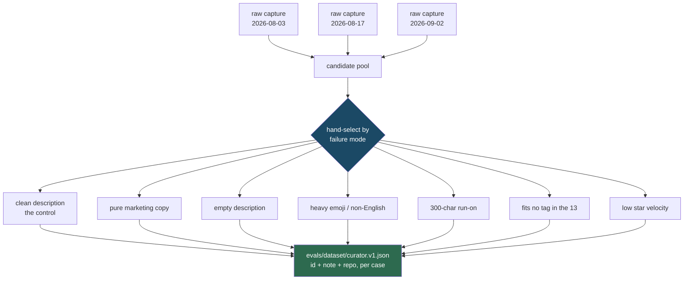

## HOW

创建 `evals/dataset/curator.v1.json`。结构：

```jsonc
{
  "version": 1,
  "capturedFrom": ["2026-08-03.json"],
  "cases": [
    { "id": "empty-description",
      "note": "parseTrendingHtml defaults description to '' — model must not invent a purpose",
      "repo": { "name": "...", "description": "", "language": "TypeScript", "stars": 900, "todayStars": 120, "url": "..." } }
  ]
}
```

这一步的功夫在于**挑选**，不在于数量。翻看你的捕获结果，挑出那些代表*任务困难的不同方式*的 repo。图里那七类
是我会从中起步的；empty-description 这一类最重要，因为 `src/tools/trending-scrape.tool.ts:21` 会把
缺失的描述默认成 `''`，所以它确实会发生，而且它是最可能让模型凭空编造功能的情况。

目标定在 24 个 case 左右 —— 三个生产形状的批次，每批 8 个。少于这个数，一个坏 repo 就会把分数拉动一大截；
多于这个数，就是在为递减的覆盖度花配额。我的观点，不是规则：15 个精挑细选的 case 胜过 40 个随手抓的。

给每个 case 都写上 `id` 和 `note`。它们不是装饰。四个月后 `empty-description` 失败时，note 会告诉你当初
你担心的是什么；没有它，你会盯着那一行猜。

在 `evals/lib/dataset.ts` 里加一个加载器 —— 签名大致是
`loadDataset(path: string): { version: number; cases: EvalCase[] }` —— 读取文件，用一个小的 Zod schema
校验，并在 `id` 重复时抛错。你本来就依赖 Zod，而一个悄悄加载成功、里面有两个 case 共用同一个 id 的数据集，
会把其中一个重复计数。

> ⚠️ **玩具捷径** —— 拿一次捕获的前 8 行。
> ✅ **生产级做法** —— 跨多次捕获手工挑选，覆盖各种失败模式。代价：一次性花一小时读描述。这是整个构建过程中
> 价值最高的一小时，因为 eval 只能衡量你摆在它面前的那些失败。

## WHY

替代方案 —— 一个随机采样的大数据集 —— 优化的是错误的变量。从 GitHub trending 随机采样得到的大多是描述良好
的热门 repo，那是简单情况的重复。你希望分数在模型对*困难*情况变差时移动，而它只有在困难情况占据可观比例时
才做得到。**权衡：** 一个刻意做难的数据集，分数会低于生产环境的真实水平。这没问题，但你必须记住：那个绝对
数字不是「digest 有多好」，而是一个在质量变化时会跟着动的敏感指标。不要把它当质量百分比说给任何人听，包括
你自己。

关于版本：`curator.v1.json` 是只追加的。你改动一个已有的 case，就让之前所有分数都不可比了。增加 case 同样
破坏可比性，所以要升到 `v2` 并开启新的 baseline 序列，而不是原地编辑。

## TEST

写 `evals/lib/dataset.test.ts`。断言：仓库里的 `curator.v1.json` 能无异常加载；每个 case 都有非空的 `id`
和 `note`；id 唯一；`cases.length` 是 8 的倍数，好让批次刚好分匀。然后喂给加载器一个内联的、含重复 id 的
对象，断言它抛错且错误信息里包含那个 id。

用 `pnpm test` 运行。通过：全绿，且测试数量按你新增的断言增加。失败：真实文件上抛错说明你的数据集格式有问题
—— 去修 JSON，不要修测试。

---

# 第 5 步 —— 让模型的原始输出可观测

## DIAGRAM

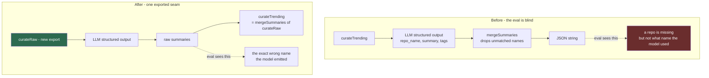

## HOW

这是对生产代码的一处小改动，位于 `src/agent/news-curator.agent.ts`。

把模型调用从 `curateTrending`（目前是第 48–62 行）中提取到一个新的导出 async 函数里。签名：

```ts
export async function curateRaw(
  repos: TrendingRepo[],
  feedback?: string
): Promise<z.infer<typeof SummarySchema>['repos']>
```

它包含 `curateTrending` 今天做的一切，*除了*最后的 `mergeSummaries` + `JSON.stringify`：构造 `listing`、
构造 `content`、调用 `createLlm(0.5).withStructuredOutput(SummarySchema).invoke(...)`、返回
`result.repos`。

`curateTrending` 随后变成它之上的两行包装，保留当前完全相同的签名和返回值，让下游什么都不用改。

你的 eval 导入 `curateRaw`。生产代码继续调用 `curateTrending`。

## WHY

没有这一步，eval 就看不到它本该衡量的那个失败。`mergeSummaries`（`src/agent/news-curator.agent.ts:27`）
会丢掉任何 `repo_name` 没对上的 repo，所以等到 `curateTrending` 返回时，一个被写错的名字和一个模型完全跳过
的 repo 已经无法区分。你的 `name_coverage` 指标能报告*有东西*丢了，却永远报告不了*模型实际输出的是什么* ——
而那恰恰是唯一能告诉你该改 prompt 还是该放弃并改代码的信息。

显然的替代方案是把那七行模型调用复制到 eval 里。千万别这么做。复制出来的调用会在你第一次改动 prompt 组装逻辑
时就发生漂移，然后你的 eval 衡量的就是一个你并不发布的函数 —— 那比没有 eval 更糟，因为它在生产已经坏掉的时候
报绿。

**诚实地说出权衡：** 你在为了测试而改动生产代码。有些人认为这是坏味道。我不这么认为，而这是一个观点：在你需要
衡量的边界上让系统变得可观测，是正常的工程实践，而且这里的改动是纯提取，没有行为差异。但它确实有代价 —— 多了
一个需要保持稳定的导出。

## TEST

现有的 `src/agent/news-curator.test.ts` 覆盖了 `mergeSummaries`，必须原封不动地保持绿色 —— 那就是这次提取
保持了行为的证据。改动前后各跑一次 `pnpm test`，比较数量和用例名。

再加一个测试，断言 `curateTrending` 仍然返回一个能解析成 `{ repos: [...] }` 的 JSON 字符串，如果能注入就
用一个打桩的 `curateRaw`；如果打桩意味着要重构模块，那就跳过它 —— 现有的 `mergeSummaries` 测试加上类型检查
已经覆盖了大部分风险。**我的观点：** 不要为了可测试性把这个模块扭曲变形；这次提取小到可以用眼睛 review 完。

---

# 第 6 步 —— 把 scorer 写成纯函数

## DIAGRAM

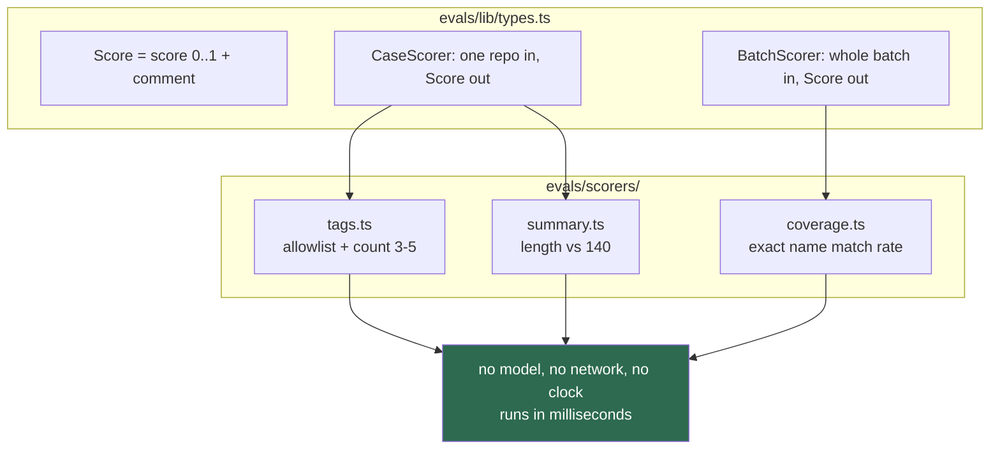

## HOW

**先写 `evals/lib/types.ts`。** 两种 scorer 形状，因为你的指标确实有两种主体：

```ts
export type Score = { score: number; comment?: string }
export type CaseScorer = (expected: EvalCase, actual: RawSummary) => Score
export type BatchScorer = (expected: EvalCase[], actual: RawSummary[]) => Score
```

`CaseScorer` 回答关于单个 repo 的问题。`BatchScorer` 回答只在整个批次层面才存在的问题 —— 「回来了多少个？」
没法对单个 repo 提问。

**然后写 `evals/scorers/tags.ts`。** 把允许列表声明成一个 `Set<string>`，取自 `src/agent/prompt.ts:46`
的 13 个值。用 `Set` 是因为你要在循环里做成员检查，而 `.has()` 表达的正是这个意思。

逻辑，用散文描述：把 tags 按允许列表切分成合法与非法两部分；如果有非法的，返回 `0` 并在 comment 里点名它们；
否则如果数量不在 3–5 之间，返回 `0` 并在 comment 里给出实际数量；否则返回 `1`。

唯一值得展示的片段是 comment，因为这正是人们会省略、事后又后悔的部分：

```ts
if (invalid.length) return { score: 0, comment: `invalid tags: ${invalid.join(', ')}` }
```

六周之后，日志里一个光秃秃的 `0.75` 毫无用处。而 `invalid tags: react, web` 会告诉你模型并不蠢 —— 它挑的是
合理的 tag，只是你的 prompt 没能约束住 —— 这指向的是改 prompt，而不是换模型。

**`evals/scorers/summary.ts`** 是同样的形状：`summary.length <= 140` 则 `1`，否则 `0` 并在 comment 里写出
实际长度。要衡量原始 summary，在 `src/tools/news-telegram.tool.ts:34` 的截断*之前*。整件事的意义就是看见
截断藏起来了什么。

**`evals/scorers/coverage.ts`** 是批次 scorer：构造一个期望名字的 `Set`，统计有多少个在实际输出中完全出现，
返回比例。comment 里应该列出模型输出的、什么都没匹配上的那些名字 —— 那正是第 5 步存在的意义所在的诊断信息。

注意这里刻意的不对称：`tag_validity` 和 `summary_length` 对每个 repo 是二元的；`name_coverage` 是按比例的。
一个非法 tag 破坏可搜索性的程度和五个一样彻底，所以二元在那里是对的。8 个里丢 1 个确实只有丢 8 个的八分之一那么
糟，所以按比例在那里是对的。**这是一个判断，你可以有不同意见** —— 但如果你改了其中一个，请在历史文件里记下来，
因为按比例的分数不能和二元的 baseline 比较。

## WHY

替代方案是让 scorer 接收整次运行、返回一个混合数字。代码更少，但用起来糟糕得多：你失去了说出是*哪条*约束松动的
能力，也没法让某个指标比另一个跑得更频繁。

纯粹性是承重属性。没有模型、没有网络、没有 `Date.now()`。正是这一点让它们能在你的 PR 关卡里免费运行（第 11 步），
也让你不花 API 配额就能调试打分逻辑。**权衡：** 纯粹性意味着 scorer 不能自适应地做任何判断 —— 比如它没法问模型
「`web3` 是不是和 `framework` 足够接近？」这是正确的限制。如果一个属性需要判断力，它就不是确定性 scorer，它属于
另一个你还没建的、经过校准的层。

## TEST

那是第 7 步 —— 它足够重要，值得单独成为一步。

---

# 第 7 步 —— 测试 scorer，包括刻意让它变红

## DIAGRAM

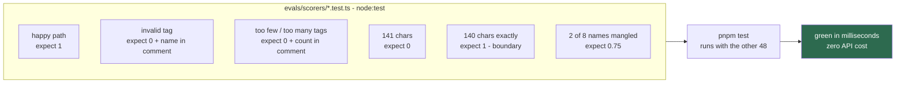

## HOW

每个 scorer 旁边放一个 `*.test.ts`，用 `node:test` 和 `node:assert/strict` —— 和
`src/agent/news-curator.test.ts` 是同一种风格，没有新东西要学。

给每个 scorer 写四类用例：

1. **Happy path** → 断言 `score === 1`。
2. **它存在的意义所在的那个失败** → 断言 `score === 0` *并且* comment 点名了违规者。第二条断言才是重要的那条：

   ```ts
   assert.match(comment ?? '', /web3/)
   ```

   它是你重构时让 comment 保持诚实的东西。一个返回了正确数字但 comment 没用的 scorer，是一个你不会据以行动的
   scorer。
3. **边界。** 正好 140 字符必须通过；141 必须失败。正好 3 个和正好 5 个 tag 必须通过；2 个和 6 个必须失败。
   scorer 里的差一错误是无声且有毒的 —— 它把你的 baseline 挪动几个百分点，而你会把它归咎于模型。
4. **部分得分**，只针对 `coverage`：期望 8 个、匹配 6 个 → 断言 `0.75`。

## WHY

测试你的测试代码听起来是循环论证。它不是，理由在于不对称：一个坏掉的、过于频繁返回 `1` 的 scorer 会产生一个永远
绿色的 eval，那严格来说比没有 eval 更糟，因为你会相信它。一个过于频繁返回 `0` 的坏 scorer 会产生噪声，你最终会
把它关掉。这两种失败从 eval 自身的输出里都看不出来。

另一个理由是经济上的。这些测试在毫秒内跑完，不需要 API key。你在这里找到的每一个打分 bug，都是你没有花真实模型
调用去发现的 bug —— 而在 OpenRouter 免费额度上，那些调用是稀缺的每日资源（第 11 步）。

**权衡：** 大约 60 行测试代码对应 30 行逻辑。这个比例看着不对，但在这里是正确的，因为 scorer 是你的测量仪器。
仪器是要校准的。

## TEST

这一步本身*就是*测试。运行 `pnpm test`；期望 48 加上你新增的用例，全绿，总耗时仍然是几秒。

然后做那件几乎所有人都跳过的事：**故意弄坏一个 scorer。** 把允许列表的检查反过来，确认整个套件变红且失败信息
指向正确的测试，然后还原。一个你从没见它失败过的测试，还不算任何证据。

---

# 第 8 步 —— 写 runner

## DIAGRAM

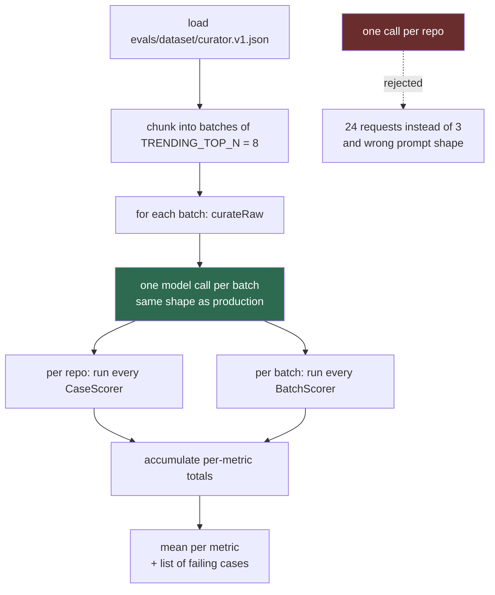

## HOW

创建 `evals/curator.eval.ts`。它按顺序做五件事：加载数据集、分块、按块调用模型、打分、报告。

**分块。** 把 case 分组成大小为 `TRENDING_TOP_N` 的数组（从 `src/constants/index.ts` 导入这个常量；不要硬编码
8）。24 个 case → 3 个批次 → 3 次模型调用。

**调用。** 每个批次，把每个 case 的 `repo` 映射成 `TrendingRepo` 并把数组传给 `curateRaw`。不要传 `feedback`
—— 那个参数是给重试路径用的，用它就等于在评估一个不同于生产首发的 prompt。

**打分。** 对每条返回的 summary，按名字精确查回它的 case 并运行所有 `CaseScorer`。对每个批次运行所有
`BatchScorer`。模型丢掉的 repo 完全不产生 `CaseScorer` 结果 —— 不要把它们在 tags 上记 `0`。它们已经被
`name_coverage` 计入了，重复计分会让一个失败同时拉动两个指标，从而破坏第 1 步「每个指标指向一个修法」的性质。

**报告。** 每个指标打印一行，然后是各个具体失败：

```
tag_validity     0.79  (19/24)
summary_length   0.92  (22/24)
name_coverage    0.96  (23/24 names matched)

  ✗ tag_validity  empty-description   invalid tags: web3, react
  ✗ name_coverage batch-2             model emitted "vercel/nextjs" for "vercel/next.js"
```

均值告诉你*要不要*在意；逐 case 的行告诉你*该做什么*。一个只打印数字的 eval 会把你打发去翻 LangSmith 的 trace
才能搞清楚发生了什么。

在模型调用外面加上错误处理：抛异常时把该批次记为失败并附上错误信息，然后继续下一个批次。批次 2 的限流不应该把
批次 1 和 3 也一并丢掉。

> ⚠️ **玩具捷径** —— 每个 repo 一次模型调用，因为这样写起来更简单。
> ✅ **生产级做法** —— 按生产的批次大小分批。这主要不是配额问题（虽然在 50 次/天的免费额度上，3 次请求对 24 次
> 是有区别的）。真正的原因是 `curateTrending` 把 8 个 repo 放在一个 prompt 里发出去，而一个含 8 个 repo 的
> prompt，与一个含 1 个 repo 的 prompt，在指令遵循上是可度量地不同的问题。

## WHY

runner 刻意不做重试。`runCuratorGraph` 在生产里重试，那在那里是对的；在这里它会掩盖你正要衡量的东西，因为一个被
第 2 次尝试救回来的模型，得分会和第 1 次就做对的模型一样。**权衡：** 相对于用户实际看到的效果，你的 eval 分数因此
是*偏悲观*的，因为生产环境还有第二次机会。这是正确的偏差方向，值得写进注释，免得你以后把它「修」掉。

把文件命名成 `.eval.ts` 而不是 `.test.ts` 是承重的：它让这个缓慢、依赖网络、偶尔被限流的脚本待在给 PR 把关的
glob 之外。

## TEST

runner 没有单元测试，我想明确说明原因：它是集成胶水，各个零件都已经被测过了 —— 第 4 步的数据集加载器、第 7 步的
scorer —— 而剩下的行为是一次真实模型调用，无法被确定性地断言。在这里 mock 模型，测的只是你的 mock 返回了你让它
返回的东西。

用运行来测试它，跑两次：

```bash
LLM_API_KEY=... pnpm eval
```

**通过：** 打印出三个指标，分母等于你的 case 数量，且每一行失败都点名了数据集里真实存在的 case id。
**失败，以及各自的含义：** `LLM_API_KEY is not set` 来自 `src/agent/llm.ts:27`，是正确的快速失败行为。分母
小于 case 数量说明分块把 case 弄丢了。第一次运行三个指标都正好是 `1.00` 是可疑而不是好事 —— 临时把 runner 指向
一个你手动改成不可能满足的数据集 case，确认分数会动。

---

# 第 9 步 —— 记录运行，带完整来源信息

## DIAGRAM

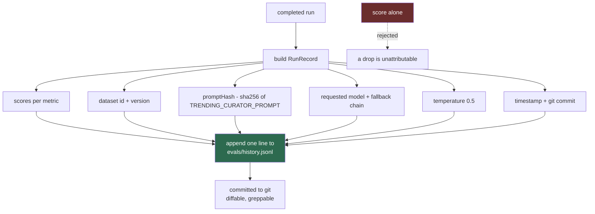

## HOW

新增 `evals/lib/record.ts`。一个类型和一个追加函数。

```ts
export type RunRecord = {
  ts: string; commit: string; dataset: string; datasetVersion: number
  promptHash: string; model: string; fallbacks: string[]; temperature: number
  scores: Record<string, { mean: number; n: number }>
  failures: Array<{ metric: string; caseId: string; comment: string }>
}
```

`appendRun(record)` 用 `JSON.stringify` 序列化，向 `evals/history.jsonl` 追加一行加 `\n`。用追加模式打开；
绝不要读-改-写，这样两次运行才不会互相覆盖。

**`promptHash`** 放进 `evals/lib/fingerprint.ts`：从 `src/agent/prompt.ts` 导入
`TRENDING_CURATOR_PROMPT`，用 `node:crypto` 做哈希，取前 8 个十六进制字符。

```ts
createHash('sha256').update(TRENDING_CURATOR_PROMPT).digest('hex').slice(0, 8)
```

导入真实的 prompt 而不是粘贴一份副本，正是这里的全部意义：你改 prompt 时哈希会自动改变，什么都不用记。

**model 这个字段是有意思的地方，也是我部分不确定的地方。**
`src/agent/llm.ts:37` 会发送 `modelKwargs: { models: [primary, ...fallbacks].slice(0, 3) }`，所以当主模型
容量不足时，OpenRouter 可能改用 `nemotron-3-super-120b` 或 `gemma-4-31b` —— 而*你的代码里没有任何信号*。
由静默模型替换导致的分数下跌，看起来和由你改 prompt 导致的分数下跌一模一样。

两个选项：

- **记录你请求的。** 记下 `process.env.LLM_MODEL || DEFAULT_LLM` 加上整条 `LLM_FALLBACK_MODELS` 链。零代码
  改动。留下一个已知盲区：你知道哪三个*可能*服务了它，但不知道实际是哪一个。
- **记录实际服务的。** LangChain 的 `.withStructuredOutput(schema, { includeRaw: true })` 返回
  `{ raw, parsed }`，实际服务的模型名应该在 `raw.response_metadata` 上。**我没有对着 OpenRouter 跑过，
  无法保证字段名** —— 先把整个 `response_metadata` 对象打印一次，再挑出那个 key。它还意味着要改
  `curateRaw` 的返回类型，也就是又一次改动生产代码。

我的建议：现在先上选项 1，用 LangSmith 补这个缺口 —— `morning-news.yml` 已经设置了
`LANGSMITH_TRACING: 'true'`，trace 会记录实际服务的模型。等到第一次真的分不清分数下跌原因时，再转到选项 2。
这是关于投入的判断，不是技术上的必然。

## WHY

替代方案是把分数打印到 stdout，然后在 CI 日志里看。那是玩具做法，理由只有一个：没有历史，你就算不出第 10 步需要的
滚动中位数，于是只能用绝对阈值 —— 而绝对阈值要么低到永不触发，要么高到被噪声触发。

用 JSONL 而不是数据库或 CSV：追加时不需要解析、在 git 里 diff 得清清楚楚、可以 `grep`，而且加指标时不需要 schema
迁移。**权衡：** 它不可查询，而且会一直增长。按每周运行算，一年 52 行，所以在这个项目失去价值之前，这都不会成为问题。

记录来源信息，正是让这个数字*抗变更*的原因。每个字段的存在都是为了在下跌之后回答一个问题：`promptHash` —— 我改
prompt 了吗？`model` —— 供应商在我背后换模型了吗？`datasetVersion` —— 我比较的是同类东西吗？`commit` —— 还有
什么变了？没有它们，一个变红的 eval 就是一份无法证伪的担忧。

## TEST

写 `evals/lib/record.test.ts` —— 纯的，不含模型。

断言 `fingerprint()` 在两次调用之间稳定、长度为 8、对不同输入字符串给出不同结果。断言 `appendRun` 恰好写出一行
并以 `\n` 结尾，该行经 `JSON.parse` 回来后深度相等，且追加两次会产生两行、第一行未被修改。用临时路径，不要用真实的
`history.jsonl`。

用 `pnpm test` 运行。值得认识的失败模式：fingerprint 在两次调用间变化，说明你哈希了含时间戳的东西；第二次追加把
文件截断了，说明你用 `w` 而不是 `a` 打开的。

---

# 第 10 步 —— 把分数变成判定

## DIAGRAM

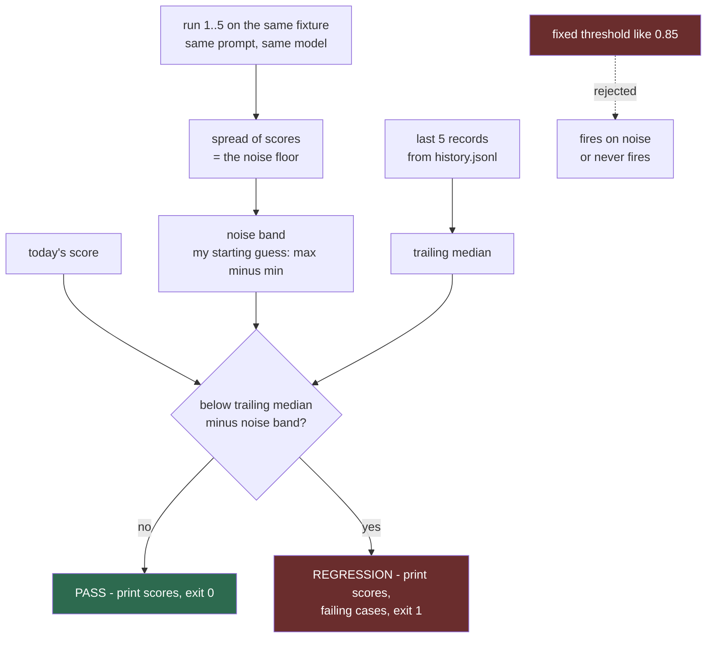

## HOW

**先测量噪声底线。这是一个手动步骤，而且不是可选的。**

`curateTrending` 调用的是 `createLlm(0.5)`（`src/agent/news-curator.agent.ts:55`）—— 温度 0.5，不是 0。
对同一份输入，模型会给出不同的答案。用同一个数据集、不变的 prompt，跑五次 `pnpm eval`，把每个指标的五个数字写
下来。如果 `tag_validity` 回来的是 `0.79, 0.83, 0.79, 0.88, 0.75`，那你的噪声带大约是 ±0.07，下个月从 0.79
变成 0.83 什么都不意味着。

不知道这个，你就没法设阈值。每次换模型或改温度，都要重做一次。

**然后写 `evals/lib/verdict.ts`。** 签名大致是：

```ts
verdict(current: RunRecord, history: RunRecord[], band: number):
  { ok: boolean; regressions: Array<{ metric: string; now: number; baseline: number }> }
```

逻辑用散文描述：把历史过滤成 `datasetVersion` 和 `promptHash` *相同*的记录 —— 跨 prompt 变更做比较是没有意义的。
取最近五条，按指标计算中位数。若 `current < median - band` 则该指标出现回退。只有在没有任何回退时才返回 `ok`。
当可比较的历史记录少于三条时，返回 `ok: true` 并在输出里说明 —— 你还在收集 baseline。

把它接进 runner：打印 `PASS` 或 `REGRESSION`，附上指标、今天的分数，以及它跌破的那个 baseline。
**把退出码放在一个环境变量开关后面** —— `EVAL_GATE=1` 时回退才设置 `process.exitCode = 1`；不设它时 runner
总是以 0 退出。

> ⚠️ **玩具捷径** —— 固定阈值，`score < 0.85` 就失败。
> ✅ **生产级做法** —— 相对滚动中位数的差值，配上一个你实测出来的带宽。固定阈值根本不知道你模型的正常水平是多少；
> 在一个温度 0.5 的免费模型上，它要么落在噪声之下从不触发，要么落在噪声之内每周狼来了。代价：在你积累若干次历史
> 之前无法开启关卡。这是特性 —— 它阻止你对一个自己还不理解的数字设关卡。

用中位数而不是均值，因为一次被限流产生的垃圾分数会把均值拖累好几周。

## WHY

判定的替代方案是每周由你自己解读一个数字。那会以可预见的方式衰减：你会认真读一个月，然后就不读了，于是 eval 变成
一个烧配额、不告知任何人的定时任务。判定把一个指标转成一个决定，而这是唯一能在你失去兴趣之后仍然存活的形式。

`EVAL_GATE` 开关的存在，是因为在你了解噪声底线之前就开启关卡，只会产生一个你学会忽略的红色构建 —— 而一个你会忽略
的关卡比没有关卡更糟，因为它训练你对红色视而不见。**权衡：** 不设关卡的 eval 同样可能被忽略。缓解手段是第 11 步的
通知路径，而不是更早地开关卡。

我不确定的地方：「五次运行的最大值减最小值」是不是正确的带宽。它很粗糙，而且在小样本上会高估。更多次运行的标准差
在统计上更好，但要花你也许不愿意花的配额。我会从粗糙开始，只有在判定开始反复横跳时才把它做得更讲究。

## TEST

`evals/lib/verdict.test.ts`，纯的，用手工构造的 `RunRecord` fixture —— 不做文件 I/O，不调模型。

断言：落在带宽内的分数通过；低于 `median − band` 的分数触发回退并点名指标；`promptHash` 不同的历史被排除掉
（构造一个「若把它算进来判定就会翻转」的用例，并断言它没有翻转）；可比较记录少于三条时返回 `ok: true`；历史中的一个
极端离群值不会把中位数挪动到足以把一次真实回退变成通过。

通过的样子是 `pnpm test` 全绿。最有价值的一次刻意失败：删掉 `promptHash` 过滤条件，确认那条排除性测试变红。那个
过滤器是你与「跨两个不同 prompt 比较分数」之间唯一的屏障。

---

# 第 11 步 —— 在 CI 里运行它

## DIAGRAM

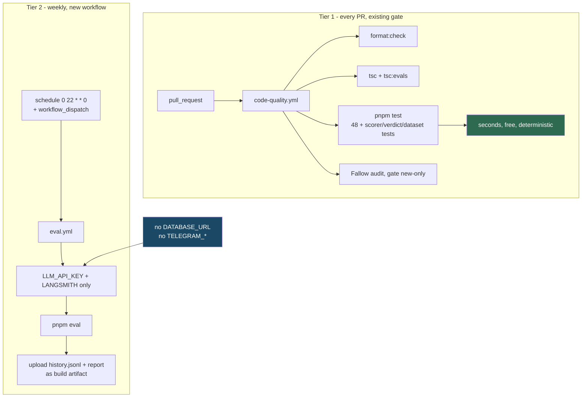

## HOW

**第一层 —— 没有新东西要建。** 你在第 2 步做的 glob 改动，已经让 scorer、dataset、verdict 和 record 的测试
在 `code-quality.yml` 现有的 `test` job 里运行了。在 `typecheck` job 里加一步 `pnpm tsc:evals`，这样 eval
代码就不会在无人察觉时烂成类型错误。

**第二层 —— 一个新的 `.github/workflows/eval.yml`。** 从 `morning-news.yml` 复制骨架，它已经是对的形状，改五个
地方：

- `on: schedule` 改成每周，例如 `cron: '0 22 * * 0'`，再加 `workflow_dispatch`。
- 保留仓库惯用的 `if: github.event_name == 'schedule' || github.actor == 'DamengRandom'` 守卫，与你其他
  workflow 一致。
- `env:` 里放 `LLM_API_KEY` 和 `LANGSMITH_*` 三件套。**别的都不要。**
- `run: pnpm eval`。
- 用 `actions/upload-artifact` 上传 `evals/history.jsonl` 和打印出的报告。

**省略掉的部分才是重点。** **不要 `DATABASE_URL`，不要 `TELEGRAM_BOT_TOKEN`，不要 `TELEGRAM_CHAT_ID`。**
eval 必须无副作用：它不能写 Neon，也不能给你的手机发消息。不给这些 secret，比记得不去调用那些代码路径要强得多。

**配额。** OpenRouter 免费额度大约是每分钟 20 次请求、每天 50 次（凭我的记忆 —— 请查你当前的账号限额，不要相信这个
数字）。24 个 case 按 8 分批，每次运行 3 次请求。每周一次，可以忽略不计。逐 repo 调用会是 24 次，而以后加任何 judge
层都会让你最终的数字再翻一倍。分批不是省配额的小把戏；它是生产形状，便宜的配额是附赠的。

> ⚠️ **玩具捷径** —— 把 `pnpm eval` 加进 PR 关卡，好宣称它「在 CI 里跑」。
> ✅ **生产级做法** —— 确定性检查在每个 PR 上跑，真实模型 eval 定时跑。在 PR 关卡里跑真实 eval 会给每次 push 增加
> 一分钟、为改 README 错别字烧配额，并且每当 OpenRouter 恰好在限流时就卡住合并。代价：回退会在一周之内被发现，而
> 不是在造成它的那次提交上 —— 而历史里的 `promptHash` 会告诉你那是哪次提交。

**不要从 CI 提交 `history.jsonl`。** 一个定时向 master 推送的 workflow 会制造噪声，还需要为一个只有你会读的文件
申请写权限。把它作为 artifact 上传；本地手动运行时再追加。如果哪天每周运行真的变成关键依赖，再重新考虑。

## WHY

两层拆分之所以存在，是因为两半有不同的失败特征。scorer 是纯的、快的，所以对它们设关卡是免费的，而且它们的红色永远
意味着「你把东西弄坏了」。真实 eval 是慢的，而且可能因为供应商某分钟状态不好而变红 —— 而一个会因 PR 之外的原因失败
的关卡，人们会绕过去。

**权衡，而且是真实的：** 每周一次意味着从回退落地到你看见它，最长有七天。你可以每天跑，代价是 7 倍配额；我的观点是，
对一个属于个人便利性质的 digest 来说，每周是合适的，只有当你真的经历过某一周 digest 明显出错而 eval 还没跑到的情况，
我才会改成每天。

## TEST

在信任定时调度之前，先通过 `workflow_dispatch` 手动触发一次 `eval.yml`。**通过：** 运行完成，日志里显示三个指标
和一行 `PASS` / `still collecting baseline`，且 artifact 里的 `history.jsonl` 比开始时多了一行。
**失败：** `LLM_API_KEY is not set` 说明 secret 名字对不上；运行过程中写了 Neon 说明你把 `morning-news.yml`
的 `env:` 块整块复制过来了 —— 删掉 `DATABASE_URL`。

对于第一层，开一个用完即弃的 PR，里面放一个故意弄坏的 scorer，确认 `code-quality.yml` 的 `test` job 变红。然后
关掉它。这是唯一能确认你扩展的 glob 真的在 CI 里跑你的 eval 测试、而不是悄悄什么都没匹配到的办法。

---

# 第 12 步 —— 在 prompt 和模型变化时保持诚实

## DIAGRAM

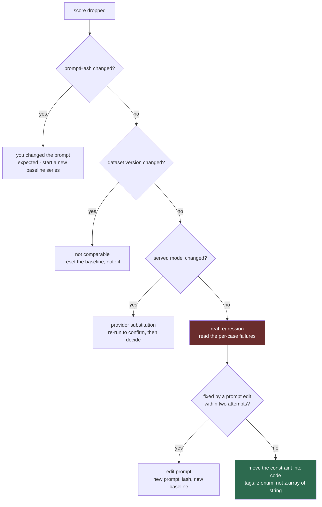

## HOW

没有新代码。这一步是操作规程，也是让前面十一步值得做的原因。

**当你有意改动 prompt 时。** `promptHash` 会变，所以第 10 步的判定会自动停止与旧序列比较，并报告「正在收集
baseline」，直到累积三次运行为止。那是正确行为，不是 bug。改完之后马上跑三次 `pnpm eval`，这样你又有了可用的
baseline。

**当你增加数据集 case 时。** 升到 `curator.v2.json`。判定会按 `datasetVersion` 过滤，所以 v1 的历史会被自动
排除。把 `v1` 留在仓库里 —— 旧分数仍然是可解读的。

**当分数下跌而你什么都没改时。** 按图操作。在你的配置下最可能的原因是供应商替换，因为 `src/agent/llm.ts:37` 发送
的是三个模型的链条，而 OpenRouter 会静默地挑一个。重跑一次；如果恢复了，那就是容量问题。如果持续，去 LangSmith
的 trace 里查实际服务的模型。

**当某个指标在两次诚实的 prompt 尝试之后依然是红的 —— 停止改 prompt，改代码。** 这是你的 eval 能告诉你的最有价值
的事。对 tags 来说这个修法很小：把 `src/agent/news-curator.agent.ts:13` 的 `SummarySchema` 从
`z.array(z.string())` 改成对那 13 个允许值的 `z.enum`，让结构化输出在 API 层强制这个约束，而不是在散文里客气地
请求。

那不是 eval 失败了。那是 eval 完成了它的工作：它证明了这个约束需要被强制执行，而它现在会为执行这个约束的代码做回归
守卫。**我诚实的预测，也是一个猜测：** 对于 tag 列表，你最后会走到这一步。我没有跑过你的模型，所以我不知道我编的
那个 `0.79` 离真实值有多远。

**现在就该知道的一处重复。** 你的允许列表会存在于两个地方 —— `src/agent/prompt.ts:46` 的 prompt 字符串，和
`evals/scorers/tags.ts` 里的 `Set`。改了一处忘了另一处，你的 eval 就会在生产已经出错时报通过。三条出路：保持重复
并接受风险；把列表从 `src/constants/index.ts` 导出并插值进 prompt；或者保持它们分开，再加一个测试断言允许列表里
的每个值都出现在 `TRENDING_CURATOR_PROMPT` 中。**我今天会选第三条** —— 五行代码，抓得住漂移，也不改变 prompt 的
可读性 —— 等到你开始给 prompt 做版本管理时再考虑第二条。这是偏好，不是正确性论证。

**大约每季度重新捕获一次 fixture**，让数据集不至于离 GitHub trending 的真实样子太远。新捕获、新数据集版本、新
baseline 序列。绝不修改已有的 case。

## WHY

替代方案是把变红的 eval 当成一件要消音的事。每一个最终被删掉的 eval，都是在这个时刻被删掉的。这棵决策树存在的意义，
是让「eval 红了」每一次都有一个明确的下一步动作，包括「这是预期之内」和「eval 是对的，答案是改代码」这两个动作。

**权衡：** 认真遵循这套规程意味着一次 prompt 改动会让你多花三次 eval 运行去重建 baseline。那是实实在在的摩擦，也是
换取一个可信数字的代价。另一种选择 —— 跨 prompt 版本比较 —— 给你一个便宜且无意义的数字。

## TEST

趁你还记得它怎么运作，刻意把这套规程走一遍。

对 `TRENDING_CURATOR_PROMPT` 做一次纯空白字符的改动，运行 `pnpm eval`，确认输出说的是它正在收集新的 baseline，
而不是在与旧序列比较。然后还原。**通过：** 判定在你没告诉它的情况下察觉了 prompt 变更。
**失败：** 如果它高高兴兴地跨越这次改动做了比较，说明你的 `promptHash` 不是从实时的 prompt import 计算出来的 ——
检查 `evals/lib/fingerprint.ts` 是从 `src/agent/prompt.ts` 导入，而不是在哈希一份粘贴的副本。

---

## 做完之后你拥有了什么

三个指标，跑在一个冻结的、富含失败模式的、取自真实抓取的数据集上；由纯函数打分，而这些函数自身也被测试过；以生产的
批次大小对着真实的 curator 运行；记录了足以归因下跌的来源信息；用实测的噪声带做判定；每周在 CI 中运行且不碰你的数据库
和你的手机；并且对它每一种变红的方式都有明确的应对动作。

这就是一个生产级 eval。大约 200 行代码，加上一小时读 GitHub 描述。

## 我不会去建的东西

- **给 `githubAgent` 做 eval。** 一个工具、`runLimit: 1`、一句「原样返回结果」的 prompt，以及已经经过 schema
  校验的工具输出。这里没有可打分的生成。
- **给 `diaryAgent` 的文笔做 eval。** 它只有一个读者，就是你，而你每天都读。建一个 judge 等于把你已经免费在做的
  review 自动化。倒是要留着 `toKpiRecord` 周围的脚手架测试 —— 报告保存失败才是真正让你付出代价的失败，而那是可以
  用代码检查的。
- **eval 框架**，直到你发现自己正在把它的某个功能拙劣地重新实现一遍。
- **Embedding 或语义相似度分数。** 你没有参考 summary，而编造它们意味着拿模型去对照你自己的文风打分。
- **通用指标** —— 「有用性」、「连贯性」。它们产出一个从不移动、也从不提示任何行动的数字。

## 我不确定的地方

明说出来，方便你相应地打折扣：

- 我没有拿你的模型跑过这个数据集。本文中所有分数都是为了举例而编的。你的真实数字可能好得多也可能差得多，而第 10 步
  的阈值必须来自你自己的五次运行，而不是来自我。
- 第 9 步中实际服务模型的 `raw.response_metadata` 字段名，未在 OpenRouter 上验证过。
- 第 11 步引用的免费额度限制是凭记忆写的；请查你的账号。
- 第 10 步中「五次运行的最大值减最小值」是不是一个好的噪声带，是一个猜测。它是刻意粗糙的；如果判定开始反复横跳，
  就把它做得更精细。
- 24 个 case 是不是合适的规模，是一个判断，不是一项发现。比起为了凑齐 40 个而卡住，我更希望你先交付 16 个精选的
  case。
